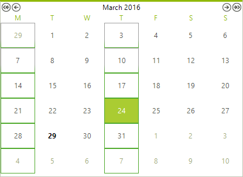

# Formatting Items

The __ElementRender__ event will be fired before every element is painted. This allows to easily change the styles of the elements at runtime, or format the items upon a condition. The following example shows how you can change the the border for a particular days. 

#### Formating items in the ElementRender event.

<snippet id='calendar-customizing-appearance-formatting-items-renderevent-cs' />
<snippet id='calendar-customizing-appearance-formatting-items-renderevent-vb' />

>caption Figure 1: RadCalendar with custom cells border.

## Refresh the visual elements at runtime.

Since the event is called when the calendar is made visible, you may need to trigger it again at run-time. This can be done by calling __RefreshVisuals__ method.

#### Trigger the ElementRender event at run-time.

<snippet id='calendar-customizing-appearance-formatting-items-refresh-cs' />
<snippet id='calendar-customizing-appearance-formatting-items-refresh-vb' />

## See Also

* [Themes]()

* [Using Templates]()

