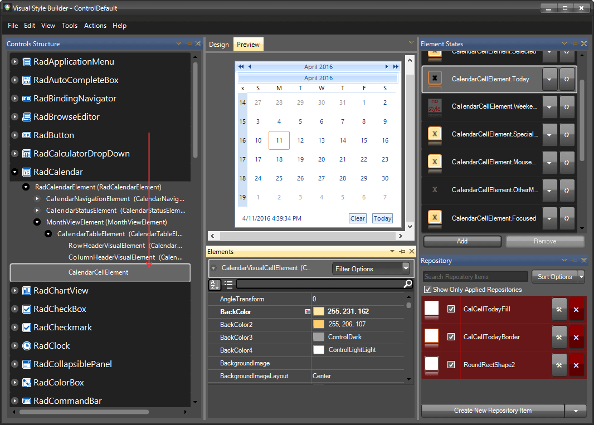
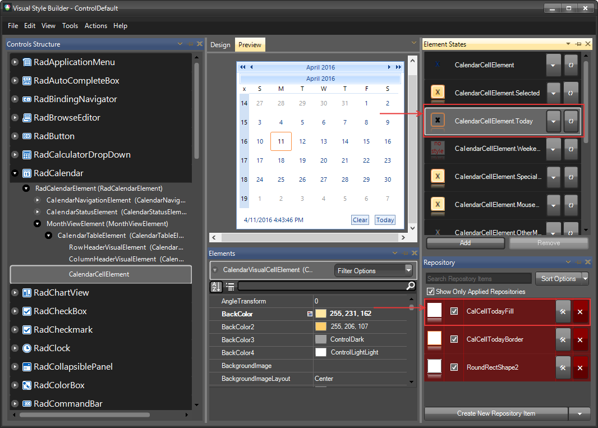
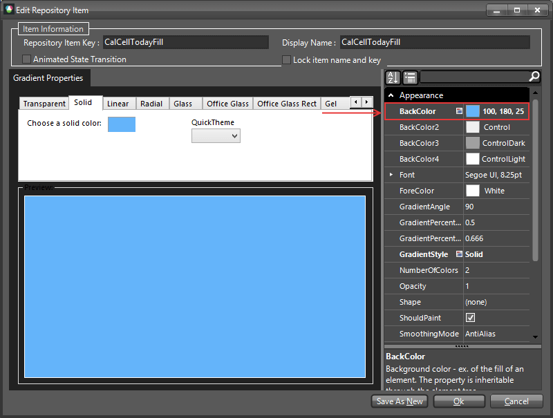
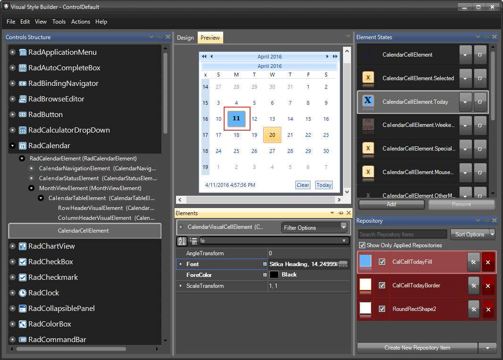

# Styling in Visual Style Builder

The following article shows how you can change the calendar cells styles in [VisualStyleBuilder](). The `CalendarTableElement` corresponds to a single month view in __RadCalendar__. The `CalendarTableElement` is the container of __RadCalendar__ cells that represent the days of the month. 

### Changing the Today cell styles in Visual Style Builder

1. Open [VisualStyleBuilder]().
2. Export the built-in themes in a specific folder by selecting `File >> Export Built-in Themes`.
3. Load a desired theme from the just exported files by selecting `File >> Open Package`.
4. Select __RadCalendar__ and expand the elements up to `CalendarCellElement`.
   
5. Select the `Today` state in the `Element States` window.Then open `CalCellTodayFill` repository item.
   
6. Once the item is opened change the BackColor and close the item.
   
7. In the `Elements` window select the Font and change its style and sizе. The result can be seen in the bellow image.
   

### Common Styling Properties

You can use this approach to customize all other states styles. The following list shows some of the most important properties that can be changed:

* __BackColor:__ Gets or sets the back color which will be used in the gradient fill. 

* __BackColor2:__ Gets or sets the second back color which will be used in the gradient fill. 

* __BackColor3:__ Gets or sets the third back color which will be used in the gradient fill. 

* __BackColor4:__ Gets or sets the fourth back color which will be used in the gradient fill. 

* __NumberOfColors:__ Gets or sets the number of back colors which will take effect in the gradient fill. 

* __GradientStyles:__ Gets or sets the gradient style which will be used in the gradient fill. 

* __BorderBoxStyle:__  Gets or sets the type of border for the visual element. 

* __BorderColor:__  Gets or sets the border color. 

* __BorderColor2:__ Gets or sets the second border color. 

* __BorderColor3:__ Gets or sets the third border color. 

* __BorderColor4:__ Gets or sets the fourth border color. 

* __BorderWidth:__ Gets or sets the width of the visual element's border 

* __DrawFill:__ Gets or sets whether the gradient fill of the visual element should be drawn. 

* __DrawBorder:__ Gets or sets whether the border of the visual element should be drawn. 

* __BorderGradientStyle__ - Gets or sets the border gradient style.

### Supported States 

Each day is represented by an instance of __CalendarCellElement__. The logical states of the day are embodied in the __CalendarCellElement__ properties shown below. 

* __WeekEnd:__ Indicates that the visual element is representing a week end day. 

* __OtherMonth:__  Indicates that the visual element is representing a day from another month. 

* __Selected:__ Indicates whether the current visual element is selected 

* __Today:__ Indicates whether the visual element is representing the current day. 

* __Focused:__ Indicates whether the visual element is focused. 

* __IsZooming:__ Indicates whether the visual element is in zoom-mode. 

* __IsHeader:__ Indicates whether the visual element is representing a header cell. 

* __SpecialDay:__ Indicates whether the visual element is representing a special day. 

* __OutOfRange:__ Indicates whether the visual element is representing a day which is out of the specified range.

## See Also

* [Formating Items]()

* [Using Templates]()
 
