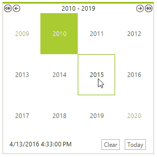

# Customizing Zoom Navigation

This article will guide you through the process of creating a month-year picker. For this purpose, it is necessary to set the __HeaderNavigationMode__ property to HeaderNavigationMode.*Zoom* and set the __ZoomLevel__ property to ZoomLevel.*Months*. This will allow the user to select a specific __CalendarCellElement__ and navigate upwards/downwards in the __RadCalendar__ similar to Windows calendar. 

<snippet id='calendar-customizing-behavior-customizing-zoom-navigation-monthyearpicker-cs' />
<snippet id='calendar-customizing-behavior-customizing-zoom-navigation-monthyearpicker-vb' />

 
In addition, you should subscribe to the __ZoomChanging__ event and stop navigation from the currently selected month to its days representation and from a year to a range of years.

<snippet id='calendar-customizing-behavior-customizing-zoom-navigation-monthyearpickerevent-cs' />
<snippet id='calendar-customizing-behavior-customizing-zoom-navigation-monthyearpickerevent-vb' />

>caption Figure 1: The zoom level is limited to months.

## See Also

* [Zoom]()
