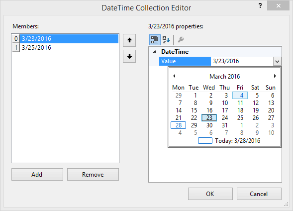

# Adding Selected Dates

Click the ellipses in the `Property Window` to edit the __SelecteDates DateTime__ collection at design-time. 

* Use the `Add` button to add a `DateTime` value to the collection.
            

* To edit a given date, select it in the `Members` list and click the drop down list arrow for the `DateTime Value` property. Select from the calendar to assign the date.
            

* To remove a date select the date in the `Members` list and click the `Remove` button.
            

* Use the up and down arrow buttons to reorder the collection items.
            

* Click cancel to close the dialog without persisting your changes. Click the OK button to save your changes and close the dialog. 

>note If you close the DateTime Collection Editor, reopen and see that only the last date has persisted in the collection, verify that __AllowMultipleSelect__ is set to true. If __AllowMultipleSelect__ is *false* the expected behavior is that only the last date in the collection is used.
>

>caption Figure 1: Add selected dates.

## See Also

* [Smart Tag]()

* [Adding Special Days]()
