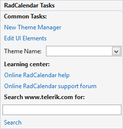

The Smart Tag of __RadCalendar__ lets you quickly access common tasks involved with customizing appearance or setting the theme.

>caption Figure 1: The smart tag of RadCalendar.

 

* __New Theme Manager:__ Adds a new __RadThemeManager__ component to the form.

* __Edit UI elements:__ Opens a dialog that displays the __Element Hierarchy Editor.__ This editor lets you browse all the elements in the control.

* __Theme Name:__ Select a theme name from the drop down list of themes available for that control. Selecting a theme allows you to change all aspects of the controls visual style. The following article shows how you can add themes: [Using themes](). 

* __Learning Center:__ Navigate to the Telerik help, code library projects or support forum.

* __Search:__ Search the Telerik site for a given string.

## See Also

* [Adding Selected Dates]()

* [Adding Special Days]()

* [Using default themes]()
