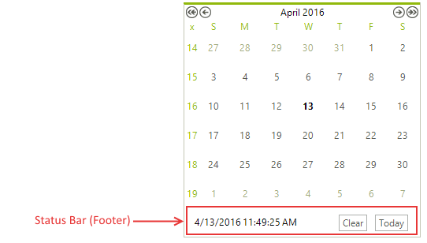

# Footer

The Footer/Status bar area of __RadCalendar__ is located below the main calendar content area. 

>caption Figure 1: The footer of RadCalendar.



By default the footer contains a string showing the current date and time and two buttons - __Clear__ button and __Today__ button. The __Clear__ button is used to clear all selected dates in __RadCalendar__ and the __Today__ button navigates to the current date. The following properties of __RadCalendar__ are used to modify appearance and functionality of the footer:

* __ShowFooter:__ Gets or sets whether RadCalendar will display its footer/status bar.

* __TodayButton:__ Gets an instance of RadButtonElement representing the Today button in the footer. 

#### Using the Today button

{{source=..\SamplesCS\Calendar\Calendar1.cs region=usingTodayButton}} 
{{source=..\SamplesVB\Calendar\Calendar1.vb region=usingTodayButton}} 

````C#
radCalendar1.TodayButton.Text = "Go to Today";
radCalendar1.TodayButton.Image = imageList1.Images[0];

````
````VB.NET
RadCalendar1.TodayButton.Text = "Go to Today"
RadCalendar1.TodayButton.Image = ImageList1.Images(0)

````

{{endregion}} 
 
* __ClearButton__ - gets an instance of RadButtonElement representing the Clear button in the footer.

## See Also

* [Header]()
* [Column and Row Headers]()
* [Keyboard Navigation]()
* [MultiView]()
* [Navigation]()
* [Repeating Events]()
* [Selecting Dates]()
* [Zoom]()

