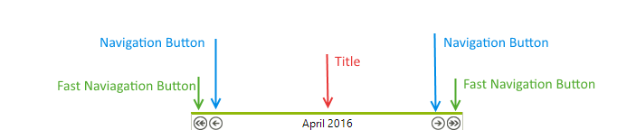

# Header

The Header area of __RadCalendar__ is located above the calendar's content area. The header contains the calendar title and the navigation buttons.

>caption Figure 1: The structure of RadCalendar header.

Use the the following properties to modify title appearance and functionality:

*  __TitleFormat:__ Gets or sets the format string that is applied to the calendar title. 

*  __TitleAlign:__ Gets or sets the horizontal alignment of calendar's title.

*  __ShowHeader:__ Gets or sets whether the calendar will display the title. 

*  __ShowNavigationButtons:__ Gets or sets whether the navigation buttons should be visible.

*  __ShowFastNavigationButtons:__ Gets or sets whether the fast navigation buttons should be visible.

*  __FastNavigationNextImage:__ Gets or sets the image that is displayed for the fast next navigation control.

*  __FastNavigationNextText:__ Gets or sets the text that is displayed for the fast next navigation control. 

* __FastNavigationNextToolTip:__ Gets or sets the tool tip that is displayed for the fast next navigation control. 

* __FastNavigationPrevImage:__ Gets or sets the image that is displayed for the fast previous navigation control. 

* __FastNavigationPrevText:__ Gets or sets the text that is displayed for the fast previous navigation control. 

* __FastNavigationPrevToolTip:__ Gets or sets the tool tip that is displayed for the fast previous navigation control. 

* __NavigationNextImage:__ Gets or sets the image that is displayed for the navigation next  control. 

* __NavigationNextText:__ Gets or sets the text that is displayed for the navigation  next  control. 

* __NavigationNextToolTip:__ Gets or sets the tool tip that is displayed for the navigation next  control. 

* __NavigationPrevImage:__ Gets or sets the image that is displayed for the navigation previous control. 

* __NavigationPrevText:__ Gets or sets the text that is displayed for the navigation previous rev control. 

* __NavigationPrevToolTip:__ Gets or sets the tool tip that is displayed for the navigation previous control. 

* __FastNavigationStep:__ Gets or sets the number of views that will be scrolled when the user clicks on a fast navigation link.

## Title Properties

You can customize the __RadCalendar Title__ to define how and what information should be shown: 

* Control title alignment using the __TitleAlign__ property. 

* Control title format using the __TitleFormat__ property. For details about available format characters see the [Date Format Pattern]() topic.

* The separator string that is placed between the start and end dates in a MultiView title is controlled by the __DateRangeSeparator__ property. 

* To allow navigation in the calendar, set the __EnableNavigation__ property to true. Customize the fast navigation buttons using the following properties:
     
    - FastNavigationNextImage

    - FastNavigationNextText

    - FastNavigationNextToolTip

    - FastNavigationPrevImage

    - FastNavigationPrevText

    - FastNavigationPrevToolTip

## See Also

* [Column and Row Headers]()
* [Footer]()
* [Keyboard Navigation]()
* [MultiView]()
* [Navigation]()
* [Repeating Events]()
* [Selecting Dates]()
* [Zoom]()
