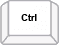
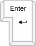

# Keyboard Navigation
 

|  |  __Key__  |  __Behavior__  |
| ------ | ------ | ------ |
||PgUp key|Navigate to previous view|
||PgDown key|Navigate to next view|
||Up arrow key|Navigate to the previous week but preserving the day of the week. If the previous date is part of the previous month the calendar view changes to previous month.|
||Down arrow key|Navigate to the next week but preserving the day of the week. If the next date is part of the next month the calendar view changes to next month.|
||Left arrow key|Navigate to the previous day. If the previous day is part of the previous month the calendar view changes to previous month.|
||Right arrow  key|Navigate to the next day. If the next day is part of the next month the calendar view changes to next month.|
| + |Ctrl + Left arrow key|Same as Page Down key|
| + |Ctrl + Right arrow key|Same as Page Up key|
||Home key|Selects the first day of the current month. If __RangeMinDate__ is after the first day of the month, Home navigates to the __RangeMinDate__ value.|
||End key|Selects the last day of the current month. If __RangeMaxDate__ is before the end of the month, End navigates to the __RangeMaxDate__ value.|
||Space key|Selects focused date.|
||Enter key|Selects focused date|

## See Also

* [Header]()
* [Footer]()
* [Column and Row Headers]()
* [MultiView]()
* [Navigation]()
* [Repeating Events]()
* [Selecting Dates]()
* [Zoom]()
