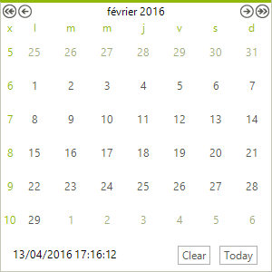

# Globalization Properties

The __Culture__ property can be set using the drop down list in the Properties Window or set in code. The screenshot below shows the __Culture__ property set to "French (France)".

>caption Figure 1: RadCalendar with French culture.



#### Setting CultureInfo in code 


{{source=..\SamplesCS\Calendar\ColumnRowHeaders.cs region=globalization}} 
{{source=..\SamplesVB\Calendar\ColumnRowHeaders.vb region=globalization}} 

````C#
radCalendar1.Culture = CultureInfo.GetCultureInfo("fr-FR");

````
````VB.NET
RadCalendar1.Culture = CultureInfo.GetCultureInfo("fr-FR")

````

{{endregion}} 


Additional properties that relate to globalization are:


| Property | Description |
| ------ | ------ |
|DayNameFormat|Specifies the display format for the days of the week on RadCalendar. Values for this property are __Full__ , __Short__ , __FirstLetter__ , __FirstTwoLetters__ , and __Shortest__ .|
|Culture|Gets or sets the culture supported by this calendar.|
|CurrentCalendar|Gets the default System.Globalization.Calendar instance as specified by the default culture.|
|DayCellFormat|Gets or sets the formatting string that will be applied to the days in the calendar. The default value is "%d".|
|FirstDayOfWeek|Specifies the day to display as the first day of the week. Valid values are __Default__ , __Sunday__ , __Monday__ , __Tuesday__ , __Wednesday__ , __Thursday__ , __Friday__ and __Saturday__ .|
|TitleFormat|Gets or sets the format string that is applied to the calendar title. The default value is "MMMM yyyy".|
|CellToolTipFormat|Gets or sets the format string that is applied to the days cells tooltip. The default value is "dddd.MMMM dd, yyyy".|
|DateRangeSeparator|Gets or sets the separator string that will be put between start and end months in a multi view title. The default value is " - ".|

## See Also

* [Date Format Pattern]()
* [CultureInfo and RegionInfo Basics]()
* [Localization]()
* [Localization Provider]()
* [Properties that can be localized]()
* [Right-To-Left Support]()
