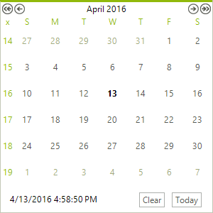
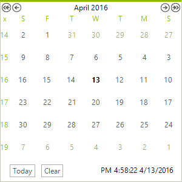

# Right-To-Left Support

__RadCalendar__ fully supports right-to-left (RTL) language locales. You can enable/disable the right-to-left support using the __RightToLeft__ enumeration, which has two members: __Yes__, __No__.

>caption Figure 1: RightToleft = No


>caption Figure 2: RightToleft = Yes



#### Setting RightToLeft

{{source=..\SamplesCS\Calendar\ColumnRowHeaders.cs region=rtl}} 
{{source=..\SamplesVB\Calendar\ColumnRowHeaders.vb region=rtl}} 

````C#
radCalendar1.RightToLeft = RightToLeft.Yes;

````
````VB.NET
RadCalendar1.RightToLeft = RightToLeft.Yes

````

{{endregion}} 

## See Also

* [Date Format Pattern]()
* [Globalization Properties]()
* [Localization]()
* [Localization Provider]()
* [Properties that can be localized]()
* [CultureInfo and RegionInfo Basics]()

