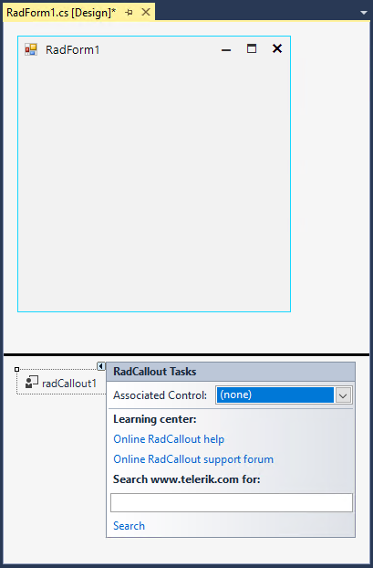
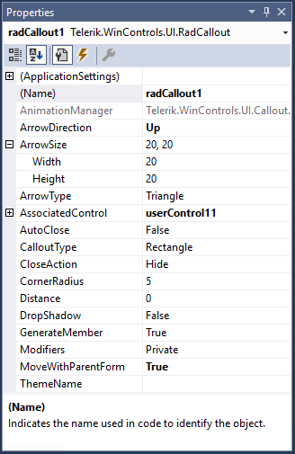

# Design Time 

To start using **RadCallout**, just drag it from the toolbox and drop it onto the form. It will be placed in the components tray.
 
## Smart Tag

Select **RadCallout** and click the small arrow on the top right position in order to open the Smart Tag.

>caption Fig.1 Smart Tag

 

It is possible to associate any control available on the form. UserControls are also supported. Just set the **Associated Control** property from the Smart Tag.

* **AssociatedControl**: allows you to set the associated  .

* **Learning Center**: Navigate to the Telerik help, code library projects or support forum.

* **Search**: Search the Telerik site for a given string.

## Design Time Properties

**RadCallout** allows adjusting the arrow direction, close action and other properties at design time:
 
>caption Fig.2 Properties

 

# See Also

* [Getting Started]()
* [Structure]() 
* [Shapes]() 
 
        
