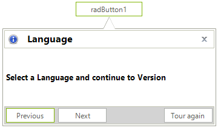
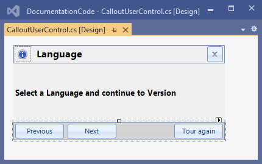
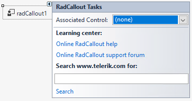

# Getting Started

This article shows how you can start using **RadCallout**. The following result will be achieved at the end of this tutorial:



>note The design may vary according to the applied theme to the application. 

Follow the steps:

1\. Go ahead and add a **RadCallout** and a **RadButton** from the toolbox.

2\. Add a **UserControl** to the form. Its design depends on the exact requirement a developer may have. 

The following UserControl contains:

* Header **RadPanel** which is docked to Top. It hosts a **RadPictureBox** showing the information image, a **RadLabel** displaying the "Language" caption and a **RadButton** for closing purposes. 

>important Please ensure that the close **RadButton**'s **Name** property is set to **closeButton** and the RadPanel.**Name** property is set to **headerPanel**.

* Footer **RadPanel** which is docked to Bottom. It hosts three **RadButton** controls for the "Previous", "Next" and "Tour again" actions.

* **RadLabel** for displaying the main information message "Select a Language and continue to a Version".



3\. Build the project and then add the UserControl from the toolbox to the form.

4\. Select **RadCallout** and click the small arrow on the top right position in order to open the Smart Tag. Then set the **AssociatedControl** to the UserControl we just added onto the form:



5\. At design time double-click the **RadButton** that we added in step 1. Thus, its **Click** event handler will be generated. Now, when the button is clicked, the **RadCallout** will be shown:

#### Showing the RadCallout

{{source=..\SamplesCS\Callout\CalloutSettings.cs region=ShowCallout}} 
{{source=..\SamplesVB\Callout\CalloutSettings.vb region=ShowCallout}} 

````C#
private void radButton1_Click(object sender, EventArgs e)
{
    this.radCallout1.Show(this.radButton1);
}

````
````VB.NET
Private Sub RadButton1_Click(sender As Object, e As EventArgs) Handles RadButton1.Click
    Me.RadCallout1.Show(Me.RadButton1)
End Sub

````

{{endregion}} 

6\. Run the project and click the button. Once the callout is shown, it will be automatically hidden if you click outside the callout's bounds. 

7\. It is possible to force closing the callout when the user hits the close button in the header. For this purpose it is necessary to access the close button from the UserControl and handle its **Click** event:

#### Closing the RadCallout

{{source=..\SamplesCS\Callout\CalloutSettings.cs region=CloseCallout}} 
{{source=..\SamplesVB\Callout\CalloutSettings.vb region=CloseCallout}} 

````C#
public CalloutSettings()
{
    InitializeComponent();
     
    RadButton closeButton = calloutUserControl1.Controls["headerPanel"].Controls["closeButton"] as RadButton;
    closeButton.Click += CloseButton_Click;
}

private void CloseButton_Click(object sender, EventArgs e)
{
    if (this.radCallout1.CalloutForm.Visible)
    {
        this.radCallout1.Close();
    }
}


````
````VB.NET
Public Sub New()
    InitializeComponent()
    Dim closeButton As RadButton = TryCast(CalloutUserControl1.Controls("headerPanel").Controls("closeButton"), RadButton)
    AddHandler closeButton.Click, AddressOf CloseButton_Click
End Sub

Private Sub CloseButton_Click(ByVal sender As Object, ByVal e As EventArgs)
    If Me.RadCallout1.CalloutForm.Visible Then
        Me.RadCallout1.Close()
    End If
End Sub


````

{{endregion}} 
 

# See Also

* [Getting Started]()
* [Design Time]() 
 
        
