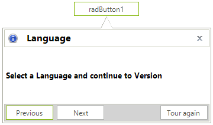
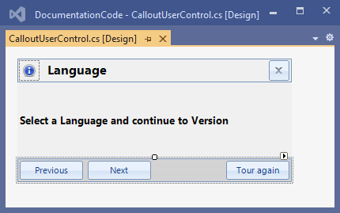
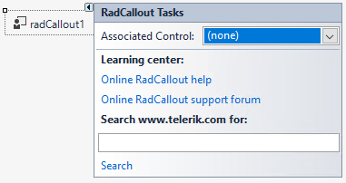

# Getting Started with WinForms Callout

This article shows how you can start using **RadCallout**. The following result will be achieved at the end of this tutorial:

>note The design may vary according to the applied theme to the application. 

## Adding Telerik Assemblies Using NuGet

To use `RadCallout` when working with NuGet packages, install the `Telerik.UI.for.WinForms.AllControls` package. The [package target framework version may vary]().

Read more about NuGet installation in the [Install using NuGet Packages]() article.

>tip With the 2025 Q1 release, the Telerik UI for WinForms has a new licensing mechanism. You can learn more about it [here]().

## Adding Assembly References Manually

When dragging and dropping a control from the Visual Studio (VS) Toolbox onto the Form Designer, VS automatically adds the necessary assemblies. However, if you're adding the control programmatically, you'll need to manually reference the following assemblies:

* __Telerik.Licensing.Runtime__
* __Telerik.WinControls__
* __Telerik.WinControls.UI__
* __TelerikCommon__

The Telerik UI for WinForms assemblies can be install by using one of the available [installation approaches](). 

## Defining the RadCallout

Follow the steps:

1\. Go ahead and add a **RadCallout** and a **RadButton** from the toolbox.

2\. Add a **UserControl** to the form. Its design depends on the exact requirement a developer may have. 

The following UserControl contains:

* Header **RadPanel** which is docked to Top. It hosts a **RadPictureBox** showing the information image, a **RadLabel** displaying the "Language" caption and a **RadButton** for closing purposes. 

>important Please ensure that the close **RadButton**'s **Name** property is set to **closeButton** and the RadPanel.**Name** property is set to **headerPanel**.

* Footer **RadPanel** which is docked to Bottom. It hosts three **RadButton** controls for the "Previous", "Next" and "Tour again" actions.

* **RadLabel** for displaying the main information message "Select a Language and continue to a Version".

3\. Build the project and then add the UserControl from the toolbox to the form.

4\. Select **RadCallout** and click the small arrow on the top right position in order to open the Smart Tag. Then set the **AssociatedControl** to the UserControl we just added onto the form:

5\. At design time double-click the **RadButton** that we added in step 1. Thus, its **Click** event handler will be generated. Now, when the button is clicked, the **RadCallout** will be shown:

#### Showing the RadCallout

<snippet id='callout-getting-started-showcallout-cs' />
<snippet id='callout-getting-started-showcallout-vb' />

6\. Run the project and click the button. Once the callout is shown, it will be automatically hidden if you click outside the callout's bounds. 

7\. It is possible to force closing the callout when the user hits the close button in the header. For this purpose it is necessary to access the close button from the UserControl and handle its **Click** event:

#### Closing the RadCallout

<snippet id='callout-getting-started-closecallout-cs' />
<snippet id='callout-getting-started-closecallout-vb' />

 

# See Also

* [Getting Started]()
* [Design Time]() 
 
        

## Telerik UI for WinForms Learning Resources
* [Telerik UI for WinForms Callout Component](https://www.telerik.com/products/winforms/callout-control.aspx)
* [Getting Started with Telerik UI for WinForms Components](https://docs.telerik.com/devtools/winforms/getting-started/first-steps)
* [Telerik UI for WinForms Setup](https://docs.telerik.com/devtools/winforms/installation-and-upgrades/installing-on-your-computer)
* [Telerik UI for WinForms Converter](https://www.telerik.com/products/winforms/documentation/ai-coding-assistant/converter/converter)
* [Telerik UI for WinForms Visual Studio Templates](https://docs.telerik.com/devtools/winforms/visual-studio-integration/visual-studio-templates)
* [Deploy Telerik UI for WinForms Applications](https://docs.telerik.com/devtools/winforms/deployment-and-distribution/application-deployment)
* [Telerik UI for WinForms Virtual Classroom(Training Courses for Registered Users)](https://learn.telerik.com/learn/course/external/view/elearning/17/telerik-ui-for-winforms)
* [Telerik UI for WinForms License Agreement)](https://www.telerik.com/purchase/license-agreement/winforms-dlw-s)

