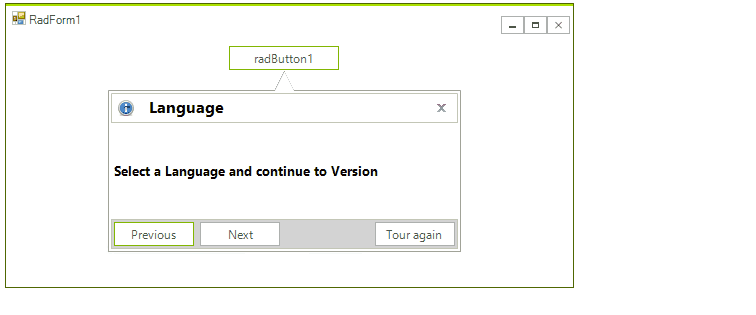
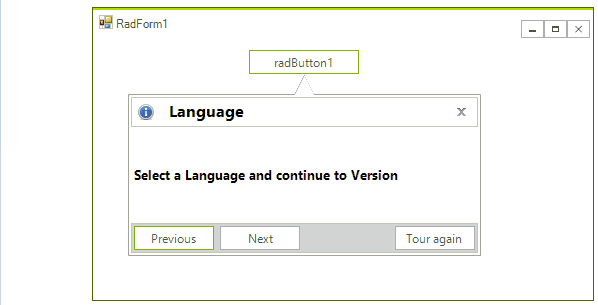
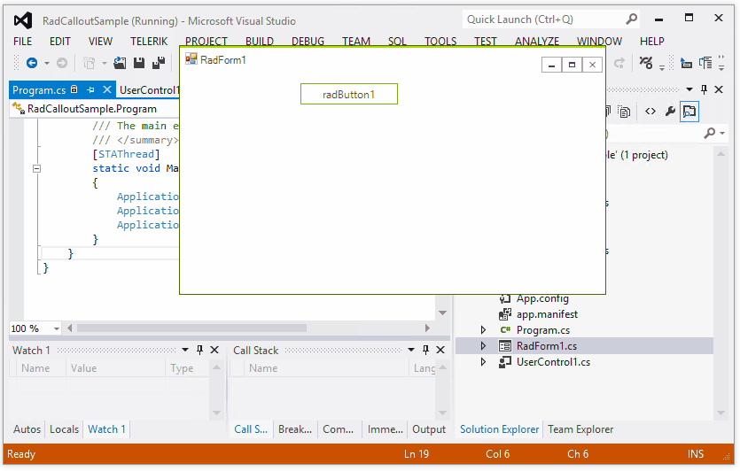
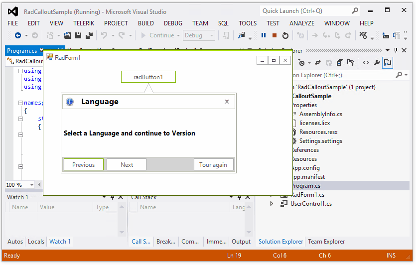
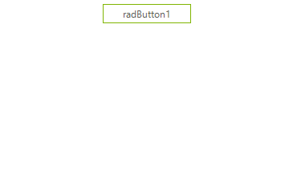

# Key Features  

Get familiar with the main features that **RadCallout** supports:

## Position Adjustment

When **RadCallout** is shown to a target control, e.g. RadButton, and this target control is moved (its **Location** is changed), the callout will adjust its position accordingly. 

>caption Move with target control
 


This behavior is controlled by the **MoveWithParentForm** property which default value is *true*. If you don't want the callout form to be moved together with the target control, set the **MoveWithParentForm** property to *false*.

If the target control is close to one of the monitor's edges (e.g. the left edge), the callout's arrow is stretched in such a way that the callout form remains on the same monitor as the target control. Once the target control goes to another monitor, the callout will jump with it as well.

>caption Move close to the monitor's edges



## AutoClose

The **AutoClose** property indicates whether the callout will automatically close. If *true*, the Mouse is captured in the callout and the callout form will be automatically closed if the user clicks outside the callout's bounds or navigate to another application.

>caption AutoClose=true



If *false*, the callout form remains shown. The developer is responsible for closing the callout form with the RadCallout.**Close** method.

>caption AutoClose=false



## Animations

**CalloutAnimationManager** holds all the animation settings and it is responsible for the callout animations. It is accessed by the RadCallout.**AnimationManager** property. 

CalloutAnimationManager offers the following public properties:

|Property|Description|
|----|----|
|**ShowAnimationType**|Gets or sets the type of show animation.|
|**ShowAnimationDuration**|Gets or sets the duration of show animation, in milliseconds.|
|**CloseAnimationType**|Gets or sets the type of close animation.|
|**CloseAnimationDuration**|Gets or sets the duration of close animation, in milliseconds.|

#### Callout Animation Settings

{{source=..\SamplesCS\Callout\CalloutSettings.cs region=Animations}} 
{{source=..\SamplesVB\Callout\CalloutSettings.vb region=Animations}} 

````C#
this.radCallout1.AnimationManager.ShowAnimationType = Telerik.WinControls.UI.Callout.CalloutAnimationType.Slide;
this.radCallout1.AnimationManager.ShowAnimationDuration = 2000;
this.radCallout1.AnimationManager.CloseAnimationType = Telerik.WinControls.UI.Callout.CalloutAnimationType.Fade;
this.radCallout1.AnimationManager.CloseAnimationDuration = 3000;


````
````VB.NET
Me.RadCallout1.AnimationManager.ShowAnimationType = Telerik.WinControls.UI.Callout.CalloutAnimationType.Slide
Me.RadCallout1.AnimationManager.ShowAnimationDuration = 2000
Me.RadCallout1.AnimationManager.CloseAnimationType = Telerik.WinControls.UI.Callout.CalloutAnimationType.Fade
Me.RadCallout1.AnimationManager.CloseAnimationDuration = 3000

````

{{endregion}}

>caption Callout Animation



# See Also

* [Getting Started]()
* [Design Time]() 
* [Shapes]() 
 
        
