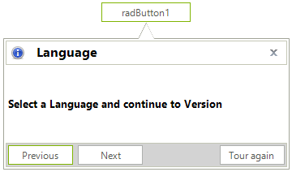

# Callout 

**RadCallout** is like a tool tip with an arrow that can be used to display additional information, warnings, hints, or to highlight relevant data. The appearance of the control can be fully customized to satisfy the needs of your scenarios. RadCallout's form is based on our [ShapedForm](), which allows users to define different shapes. 

 

## Key Features

Here are a few of the **RadCallout**'s main features:

* Host any control/panel/UserControl. This gives the ability to add the information in any design (using the full range of controls we offer) and interactivity (for example: buttons, switch buttons, check boxes, radio buttons etc.).  
* Built-in arrow. The position and shape of the arrow can be customized. 
* User Interaction - clicking, mouse over, navigating, etc.
* Animations - as a Popup, the control supports different animations for its appearance.
* Point to the exact location of a given control (MS Control or RadControl), element (TPF element) or a screen location. 
* Theming - like any other control from the UI for WinForms suite, RadCallout comes with different themes.   
 

# See Also

* [Getting Started]()
* [Design Time]() 
* [Structure]() 
* [Shapes]() 
 
        
