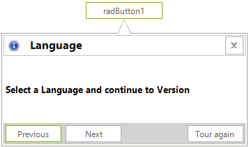
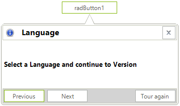
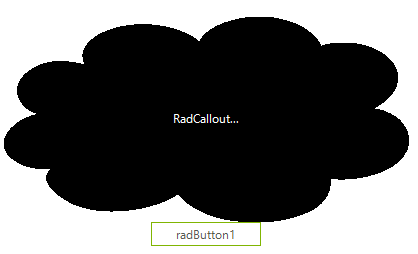
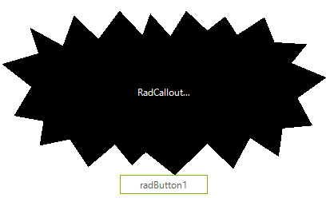

# Shapes 

**RadCallout** supports the following predefined shapes. The **CalloutType** property controls what shape will be applied:

* **CalloutType.Rectangle**:



{{source=..\SamplesCS\Callout\CalloutSettings.cs region=Rectangle}} 
{{source=..\SamplesVB\Callout\CalloutSettings.vb region=Rectangle}} 

````C#

  this.radCallout1.CalloutType = Telerik.WinControls.UI.Callout.CalloutType.Rectangle;

````
````VB.NET
   Me.RadCallout1.CalloutType = Callout.CalloutType.Rectangle

````

{{endregion}}

* **CalloutType.RoundedRectangle**:



{{source=..\SamplesCS\Callout\CalloutSettings.cs region=RoundedRectangle}} 
{{source=..\SamplesVB\Callout\CalloutSettings.vb region=RoundedRectangle}} 

````C#

   this.radCallout1.CalloutType = Telerik.WinControls.UI.Callout.CalloutType.RoundedRectangle;           

````
````VB.NET
	Me.RadCallout1.CalloutType = Callout.CalloutType.RoundedRectangle

````

{{endregion}}

All predefined callout shapes are defined as a **CalloutElementShape** which is a derivative of PathElementShape. 
 
## Custom Shapes

The CalloutForm.**Shape** property allows setting any [ElementShape]() that you may have.

>important When a custom shape, that is not a derivative of **CalloutElementShape** is set, no arrow will be rendered to the callout form due to the specifics of the WinForms graphics paths' rendering. It is up to the developer to include the arrow to the custom ElementShape.

>note When a custom shape is applied, most of the arrow and shape property settings may not be respected since the developer will be responsible for the complete rendering of the callout.

The following code snippet demonstrates how to apply one of the predefined [ElementShapes]() that the Telerik Presentation Framework offers.

#### Custom Predefined Shape

{{source=..\SamplesCS\Callout\CalloutSettings.cs region=PredefinedCustomShape}} 
{{source=..\SamplesVB\Callout\CalloutSettings.vb region=PredefinedCustomShape}} 

````C#

 this.radCallout1.CalloutForm.Shape = new DiamondShape();          

````
````VB.NET

Me.RadCallout1.CalloutForm.Shape = New DiamondShape()

````

{{endregion}}

Since the default callout shapes are defined as **CalloutElementShape**, you can create a derivative of the **PathElementShape** class and override 
the **CreatePath(Rectangle bounds)** method. Thus, you can construct any custom shape that you need. The following two examples demonstrate how to create a Cloud and Kaboom shapes for RadCallout.

#### Cloud Shape

{{source=..\SamplesCS\Callout\CalloutSettings.cs region=CloudShape}} 
{{source=..\SamplesVB\Callout\CalloutSettings.vb region=CloudShape}} 

````C#
public class CloudCalloutShape : PathElementShape
{ 
    private string CloudRelativePoints = "0.98,0.508;0.966,0.481;0.941,0.451;0.913,0.446;0.917,0.442;0.92,0.438;0.924,0.434;0.935," +
  "0.421;0.944,0.406;0.952,0.39;0.967,0.358;0.974,0.323;0.972,0.287;0.969,0.217;0.932,0.149;0.868,0.13;0.852,0.126;0.835,0.125;0.818," +
  "0.128;0.806,0.13;0.791,0.134;0.782,0.142;0.782,0.131;0.777,0.12;0.773,0.11;0.768,0.096;0.761,0.082;0.752,0.07;0.735,0.044;0.712,0.024;" +
  "0.685,0.012;0.631,-0.013;0.57,0.002;0.526,0.044;0.505,0.065;0.489,0.09;0.482,0.12;0.476,0.11;0.47,0.1;0.461,0.091;0.45,0.079;0.437,0.069;" +
  "0.423,0.06;0.397,0.044;0.367,0.035;0.336,0.037;0.275,0.04;0.219,0.083;0.2,0.149;0.195,0.166;0.193,0.185;0.195,0.203;0.195,0.212;0.196,0.223;" +
  "0.199,0.232;0.199,0.232;0.198,0.232;0.198,0.232;0.191,0.227;0.184,0.225;0.176,0.222;0.163,0.218;0.148,0.214;0.134,0.215;0.104,0.218;0.08,0.237;" +
  "0.062,0.263;0.03,0.309;0.024,0.374;0.046,0.427;0.053,0.445;0.066,0.464;0.083,0.473;0.062,0.481;0.044,0.499;0.031,0.519;0.011,0.548;-0.001,0.585;" +
  "0,0.622;0.001,0.658;0.015,0.692;0.04,0.715;0.051,0.726;0.065,0.735;0.08,0.739;0.09,0.742;0.105,0.745;0.116,0.74;0.084,0.791;0.125,0.868;0.169,0.91;" +
  "0.224,0.96;0.303,0.954;0.363,0.921;0.388,0.907;0.414,0.888;0.43,0.862;0.451,0.926;0.511,0.976;0.55,0.988;0.631,1.013;0.695,0.998;0.749,0.952;0.782," +
  "0.924;0.81,0.869;0.806,0.789;0.814,0.791;0.822,0.792;0.83,0.792;0.847,0.792;0.864,0.789;0.879,0.784;0.911,0.773;0.94,0.753;0.961,0.725;1.005,0.665;" +
  "1.012,0.576;0.979,0.508;";

    private PointF PointFromString(string s)
    {
        var pointStrings = s.Split(",".ToCharArray(), StringSplitOptions.RemoveEmptyEntries);
        float x = float.Parse(pointStrings[0]);
        float y = float.Parse(pointStrings[1]);
        return new PointF(x, y);
    }

    public override GraphicsPath CreatePath(Rectangle bounds)
    { 
        string[] pointStrings = CloudRelativePoints.Split(new char[] { ';' }, StringSplitOptions.RemoveEmptyEntries).ToArray();
        System.Collections.Generic.IEnumerable<PointF> points = pointStrings.Select(x => this.PointFromString(x));
        List<PointF> adjustedPoints = points.Select(p => new PointF((float)(p.X * bounds.Width), (float)(p.Y * bounds.Height))).ToList(); 
        GraphicsPath path = new GraphicsPath(FillMode.Winding);
        path.StartFigure();  
        for (int i = 1; i < adjustedPoints.Count; i += 3)
        { 
            path.AddBezier(adjustedPoints[i - 1], adjustedPoints[i], adjustedPoints[i + 1], adjustedPoints[i + 2]); 
        } 

        path.CloseFigure(); 
        return path;
    } 
}
          

````
````VB.NET
Public Class CloudCalloutShape
    Inherits PathElementShape

    Private CloudRelativePoints As String = "0.98,0.508;0.966,0.481;0.941,0.451;0.913,0.446;0.917,0.442;0.92,0.438;0.924,0.434;0.935," &
        "0.421;0.944,0.406;0.952,0.39;0.967,0.358;0.974,0.323;0.972,0.287;0.969,0.217;0.932,0.149;0.868,0.13;0.852,0.126;0.835,0.125;0.818," &
        "0.128;0.806,0.13;0.791,0.134;0.782,0.142;0.782,0.131;0.777,0.12;0.773,0.11;0.768,0.096;0.761,0.082;0.752,0.07;0.735,0.044;0.712,0.024;" &
        "0.685,0.012;0.631,-0.013;0.57,0.002;0.526,0.044;0.505,0.065;0.489,0.09;0.482,0.12;0.476,0.11;0.47,0.1;0.461,0.091;0.45,0.079;0.437,0.069;" &
        "0.423,0.06;0.397,0.044;0.367,0.035;0.336,0.037;0.275,0.04;0.219,0.083;0.2,0.149;0.195,0.166;0.193,0.185;0.195,0.203;0.195,0.212;0.196,0.223;" &
        "0.199,0.232;0.199,0.232;0.198,0.232;0.198,0.232;0.191,0.227;0.184,0.225;0.176,0.222;0.163,0.218;0.148,0.214;0.134,0.215;0.104,0.218;0.08,0.237;" &
        "0.062,0.263;0.03,0.309;0.024,0.374;0.046,0.427;0.053,0.445;0.066,0.464;0.083,0.473;0.062,0.481;0.044,0.499;0.031,0.519;0.011,0.548;-0.001,0.585;" &
        "0,0.622;0.001,0.658;0.015,0.692;0.04,0.715;0.051,0.726;0.065,0.735;0.08,0.739;0.09,0.742;0.105,0.745;0.116,0.74;0.084,0.791;0.125,0.868;0.169,0.91;" &
        "0.224,0.96;0.303,0.954;0.363,0.921;0.388,0.907;0.414,0.888;0.43,0.862;0.451,0.926;0.511,0.976;0.55,0.988;0.631,1.013;0.695,0.998;0.749,0.952;0.782," &
        "0.924;0.81,0.869;0.806,0.789;0.814,0.791;0.822,0.792;0.83,0.792;0.847,0.792;0.864,0.789;0.879,0.784;0.911,0.773;0.94,0.753;0.961,0.725;1.005,0.665;" &
        "1.012,0.576;0.979,0.508;"

    Private Function PointFromString(ByVal s As String) As PointF
        Dim pointStrings = s.Split(",".ToCharArray(), StringSplitOptions.RemoveEmptyEntries)
        Dim x As Single = Single.Parse(pointStrings(0))
        Dim y As Single = Single.Parse(pointStrings(1))
        Return New PointF(x, y)
    End Function

    Public Overrides Function CreatePath(ByVal bounds As Rectangle) As GraphicsPath
        Dim pointStrings As String() = CloudRelativePoints.Split(New Char() {";"c}, StringSplitOptions.RemoveEmptyEntries).ToArray()
        Dim points As System.Collections.Generic.IEnumerable(Of PointF) = pointStrings.[Select](Function(x) Me.PointFromString(x))
        Dim adjustedPoints As List(Of PointF) = points.[Select](Function(p) New PointF(CSng((p.X * bounds.Width)), CSng((p.Y * bounds.Height)))).ToList()
        Dim path As GraphicsPath = New GraphicsPath(FillMode.Winding)
        path.StartFigure()

        For i As Integer = 1 To adjustedPoints.Count - 1 Step 3
            path.AddBezier(adjustedPoints(i - 1), adjustedPoints(i), adjustedPoints(i + 1), adjustedPoints(i + 2))
        Next

        path.CloseFigure()
        Return path
    End Function
End Class


````

{{endregion}}

>caption Custom Cloud Shape



#### Kaboom Shape

{{source=..\SamplesCS\Callout\CalloutSettings.cs region=KaboomShape}} 
{{source=..\SamplesVB\Callout\CalloutSettings.vb region=KaboomShape}} 

````C#
public class KaboomCalloutShape : PathElementShape
{
    private string KaboomRelativePoints = "0.3625,0;0.433,0.147;0.457,0.017;0.519,0.154;0.568,0;0.633,0.12;0.688,0.034;0.725,0.147;0.809,0.039;0.84,0.191;" +
               "0.94,0.204;0.893,0.318;1,0.406;0.911,0.531;0.957,0.698;0.865,0.715;0.853,0.887;0.765,0.773;0.713,0.961;0.633,0.81;0.533,1;0.443,0.86;0.401,0.941;0.348," +
               "0.814;0.266,0.95;0.209,0.782;0.116,0.82;0.128,0.671;0.037,0.639;0.09,0.463;0,0.324;0.112,0.259;0.086,0.103;0.188,0.213;0.222,0.028;0.297,0.171;";
    private PointF PointFromString(string s)
    {
        var pointStrings = s.Split(",".ToCharArray(), StringSplitOptions.RemoveEmptyEntries);
        float x = float.Parse(pointStrings[0]);
        float y = float.Parse(pointStrings[1]);
        return new PointF(x, y);
    }

    public override GraphicsPath CreatePath(Rectangle bounds)
    {
        string[] pointStrings = KaboomRelativePoints.Split(new char[] { ';' }, StringSplitOptions.RemoveEmptyEntries).ToArray();
        System.Collections.Generic.IEnumerable<PointF> points = pointStrings.Select(x => this.PointFromString(x));
        List<PointF> adjustedPoints = points.Select(p => new PointF(p.X * bounds.Width, p.Y * bounds.Height)).ToList();
        GraphicsPath path = new GraphicsPath(FillMode.Winding);
        path.AddLines(adjustedPoints.ToArray());
        return path;
    }
}
          

````
````VB.NET
Public Class KaboomCalloutShape
    Inherits PathElementShape

    Private KaboomRelativePoints As String = "0.3625,0;0.433,0.147;0.457,0.017;0.519,0.154;0.568,0;0.633,0.12;0.688,0.034;0.725,0.147;0.809,0.039;0.84,0.191;" &
        "0.94,0.204;0.893,0.318;1,0.406;0.911,0.531;0.957,0.698;0.865,0.715;0.853,0.887;0.765,0.773;0.713,0.961;0.633,0.81;0.533,1;0.443,0.86;0.401,0.941;0.348," &
        "0.814;0.266,0.95;0.209,0.782;0.116,0.82;0.128,0.671;0.037,0.639;0.09,0.463;0,0.324;0.112,0.259;0.086,0.103;0.188,0.213;0.222,0.028;0.297,0.171;"

    Private Function PointFromString(ByVal s As String) As PointF
        Dim pointStrings = s.Split(",".ToCharArray(), StringSplitOptions.RemoveEmptyEntries)
        Dim x As Single = Single.Parse(pointStrings(0))
        Dim y As Single = Single.Parse(pointStrings(1))
        Return New PointF(x, y)
    End Function

    Public Overrides Function CreatePath(ByVal bounds As Rectangle) As GraphicsPath
        Dim pointStrings As String() = KaboomRelativePoints.Split(New Char() {";"c}, StringSplitOptions.RemoveEmptyEntries).ToArray()
        Dim points As System.Collections.Generic.IEnumerable(Of PointF) = pointStrings.[Select](Function(x) Me.PointFromString(x))
        Dim adjustedPoints As List(Of PointF) = points.[Select](Function(p) New PointF(p.X * bounds.Width, p.Y * bounds.Height)).ToList()
        Dim path As GraphicsPath = New GraphicsPath(FillMode.Winding)
        path.AddLines(adjustedPoints.ToArray())
        Return path
    End Function
End Class


````

{{endregion}}

>caption Custom Kaboom Shape



The last needed step is to apply the custom shape to the CalloutForm:

{{source=..\SamplesCS\Callout\CalloutSettings.cs region=ApplyShape}} 
{{source=..\SamplesVB\Callout\CalloutSettings.vb region=ApplyShape}} 

````C#

this.radCallout1.CalloutForm.Shape = new CloudCalloutShape();        

````
````VB.NET
Me.RadCallout1.CalloutForm.Shape = New CloudCalloutShape()

````

{{endregion}}

# See Also

* [Getting Started]()
* [Design Time]()
* [Properties, Methods and Events]()
 
        
