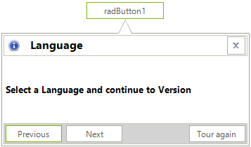
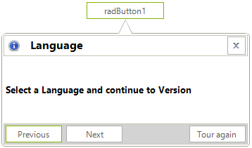
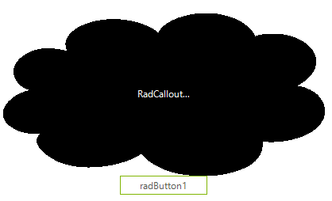
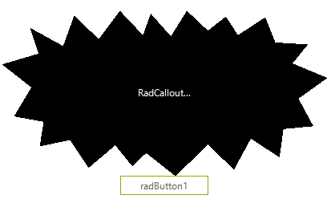

# Shapes 

**RadCallout** supports the following predefined shapes. The **CalloutType** property controls what shape will be applied:

* **CalloutType.Rectangle**:

<snippet id='callout-shapes-rectangle-cs' />
<snippet id='callout-shapes-rectangle-vb' />

* **CalloutType.RoundedRectangle**:

<snippet id='callout-shapes-roundedrectangle-cs' />
<snippet id='callout-shapes-roundedrectangle-vb' />

All predefined callout shapes are defined as a **CalloutElementShape** which is a derivative of PathElementShape. 
 
## Custom Shapes

The CalloutForm.**Shape** property allows setting any [ElementShape]() that you may have.

>important When a custom shape, that is not a derivative of **CalloutElementShape** is set, no arrow will be rendered to the callout form due to the specifics of the WinForms graphics paths' rendering. It is up to the developer to include the arrow to the custom ElementShape.

>note When a custom shape is applied, most of the arrow and shape property settings may not be respected since the developer will be responsible for the complete rendering of the callout.

The following code snippet demonstrates how to apply one of the predefined [ElementShapes]() that the Telerik Presentation Framework offers.

#### Custom Predefined Shape

<snippet id='callout-shapes-predefinedcustomshape-cs' />
<snippet id='callout-shapes-predefinedcustomshape-vb' />

Since the default callout shapes are defined as **CalloutElementShape**, you can create a derivative of the **PathElementShape** class and override 
the **CreatePath(Rectangle bounds)** method. Thus, you can construct any custom shape that you need. The following two examples demonstrate how to create a Cloud and Kaboom shapes for RadCallout.

#### Cloud Shape

<snippet id='callout-shapes-cloudshape-cs' />
<snippet id='callout-shapes-cloudshape-vb' />

>caption Custom Cloud Shape

#### Kaboom Shape

<snippet id='callout-shapes-kaboomshape-cs' />
<snippet id='callout-shapes-kaboomshape-vb' />

>caption Custom Kaboom Shape

The last needed step is to apply the custom shape to the CalloutForm:

<snippet id='callout-shapes-applyshape-cs' />
<snippet id='callout-shapes-applyshape-vb' />

# See Also

* [Getting Started]()
* [Design Time]()
* [Properties, Methods and Events]()
 
        
