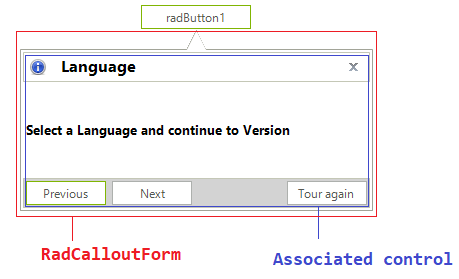

# Structure 

**RadCallout** is a component which internally has a **RadCalloutForm** that hosts the **AssociatedControl**.
 

 

The **AssociatedControl** can be any **Control** or a Control derivative.

# See Also

* [Getting Started]()
* [Design Time]() 
 
        
