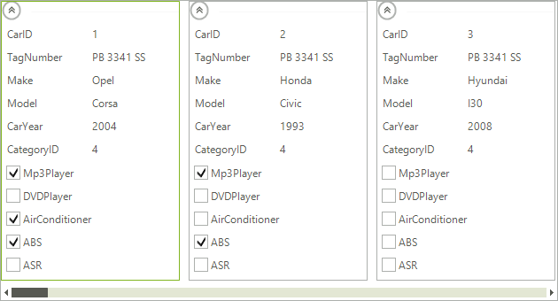

# Custom items

__RadCardView__ allows you to create and use your own custom visual items. This article demonstrates how to achieve it.

## Custom items in RadCardView

This can be done by making use of the __CardViewItemCreating__ event. The following example demonstrates creating a visual item with a checkbox in it. The checkbox itself is an editor and in order to customize it we need to extend the __CardViewItem__ and __CardViewEditorItem__ classes.

>caption Figure 1: CardView With Checkbox


First let's create our custom items:

#### Creating Custom CardViewItem

{{source=..\SamplesCS\CardView\CadViewCustomItems.cs region=CustomCardViewItem}} 
{{source=..\SamplesVB\CardView\CadViewCustomItems.vb region=CustomCardViewItem}}
````C#
public class CheckBoxCardViewItem : CardViewItem
{
    protected override void CreateChildElements()
    {
        base.CreateChildElements();
        this.TextSizeMode = LayoutItemTextSizeMode.Proportional;
        this.TextProportionalSize = 0;
    }
    protected override CardViewEditorItem CreateEditorItem()
    {
        return new CheckBoxEditorItem();
    }
    public override void Synchronize()
    {
        CardListViewVisualItem cardVisualItem = this.FindAncestor<CardListViewVisualItem>();
        if (this.CardField == null || cardVisualItem == null || cardVisualItem.Data == null)
        {
            return;
        }
        RadCheckBoxElement checkBox = ((CheckBoxEditorItem)this.EditorItem).Checkbox;
        checkBox.Text = this.CardField.HeaderText;
        checkBox.Checked = this.ContainsFeature(cardVisualItem.Data, this.FieldName);
    }
    private bool ContainsFeature(ListViewDataItem item, string feature)
    {
        return item[feature] != null && Convert.ToInt32(item[feature]) != 0;
    }
}

````
````VB.NET
Public Class CheckBoxCardViewItem
    Inherits CardViewItem
    Protected Overrides Sub CreateChildElements()
        MyBase.CreateChildElements()
        Me.TextSizeMode = LayoutItemTextSizeMode.Proportional
        Me.TextProportionalSize = 0
    End Sub
    Protected Overrides Function CreateEditorItem() As CardViewEditorItem
        Return New CheckBoxEditorItem()
    End Function
    Public Overrides Sub Synchronize()
        Dim cardVisualItem As CardListViewVisualItem = Me.FindAncestor(Of CardListViewVisualItem)()
        If Me.CardField Is Nothing OrElse cardVisualItem Is Nothing OrElse cardVisualItem.Data Is Nothing Then
            Return
        End If
        Dim checkBox As RadCheckBoxElement = DirectCast(Me.EditorItem, CheckBoxEditorItem).Checkbox
        checkBox.Text = Me.CardField.HeaderText
        checkBox.Checked = Me.ContainsFeature(cardVisualItem.Data, Me.FieldName)
    End Sub
    Private Function ContainsFeature(item As ListViewDataItem, feature As String) As Boolean
        Return item(feature) IsNot Nothing AndAlso Convert.ToInt32(item(feature)) <> 0
    End Function
End Class

```` 


{{endregion}}

#### Creating Custom CardViewEditorItem

{{source=..\SamplesCS\CardView\CadViewCustomItems.cs region=CustomCardViewEditorItem}} 
{{source=..\SamplesVB\CardView\CadViewCustomItems.vb region=CustomCardViewEditorItem}}
````C#
public class CheckBoxEditorItem : CardViewEditorItem
{
    private RadCheckBoxElement checkbox;
    public RadCheckBoxElement Checkbox
    {
        get { return this.checkbox; }
        set { this.checkbox = value; }
    }
    protected override void CreateChildElements()
    {
        base.CreateChildElements();
        this.checkbox = new RadCheckBoxElement();
        this.Children.Add(this.checkbox);
    }
}

````
````VB.NET
Public Class CheckBoxEditorItem
    Inherits CardViewEditorItem
    Private m_checkbox As RadCheckBoxElement
    Public Property Checkbox() As RadCheckBoxElement
        Get
            Return Me.m_checkbox
        End Get
        Set(value As RadCheckBoxElement)
            Me.m_checkbox = value
        End Set
    End Property
    Protected Overrides Sub CreateChildElements()
        MyBase.CreateChildElements()
        Me.m_checkbox = New RadCheckBoxElement()
        Me.Children.Add(Me.m_checkbox)
    End Sub
End Class

```` 


{{endregion}}

Back in our form we need to populate some sample data for the checkboxes as well as subscribe and handle the __CardViewItemCreating__ event. For the purpose of this example we are data binding the control to the SofiaCarRental database which is available in the installation folder of the suite.

#### Use the custom item

{{source=..\SamplesCS\CardView\CadViewCustomItems.cs region=CardViewForm}} 
{{source=..\SamplesVB\CardView\CadViewCustomItems.vb region=CardViewForm}}
````C#
private List<string> features;
public CadViewCustomItems()
{
    InitializeComponent();
    this.features = new List<string>() { "AirConditioner", "Mp3Player", "DVDPlayer", "ABS", "ASR", "Navigation", "Available" };
    this.radCardView1.CardViewItemCreating += radCardView1_CardViewItemCreating;
}
private void radCardView1_CardViewItemCreating(object sender, CardViewItemCreatingEventArgs e)
{
    CardViewItem cardViewItem = e.NewItem as CardViewItem;
    if (cardViewItem != null && this.features.Contains(cardViewItem.FieldName))
    {
        CheckBoxCardViewItem checkBoxItem = new CheckBoxCardViewItem();
        checkBoxItem.FieldName = cardViewItem.FieldName;
        e.NewItem = checkBoxItem;
    }
}
private void CadViewCustomItems_Load(object sender, EventArgs e)
{
    this.carsTableAdapter.Fill(this.sofiaCarRentalDataSet.Cars);
}

````
````VB.NET
Private features As List(Of String)
Public Sub New()
    InitializeComponent()
    Me.features = New List(Of String)() From { _
        "AirConditioner", _
        "Mp3Player", _
        "DVDPlayer", _
        "ABS", _
        "ASR", _
        "Navigation", _
        "Available" _
    }
    AddHandler Me.RadCardView1.CardViewItemCreating, AddressOf radCardView1_CardViewItemCreating
End Sub
Private Sub radCardView1_CardViewItemCreating(sender As Object, e As CardViewItemCreatingEventArgs)
    Dim cardViewItem As CardViewItem = TryCast(e.NewItem, CardViewItem)
    If cardViewItem IsNot Nothing AndAlso Me.features.Contains(cardViewItem.FieldName) Then
        Dim checkBoxItem As New CheckBoxCardViewItem()
        checkBoxItem.FieldName = cardViewItem.FieldName
        e.NewItem = checkBoxItem
    End If
End Sub
Private Sub CadViewCustomItems_Load(sender As Object, e As EventArgs) Handles MyBase.Load
    Me.CarsTableAdapter.Fill(Me.SofiaCarRentalDataSet.Cars)
End Sub

````


{{endregion}} 

# See Also

* [Structure]()
* [Design Time]()
* [Getting Started]()


