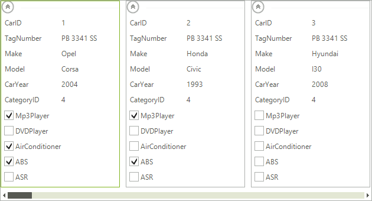

# Custom items

__RadCardView__ allows you to create and use your own custom visual items. This article demonstrates how to achieve it.

## Custom items in RadCardView

This can be done by making use of the __CardViewItemCreating__ event. The following example demonstrates creating a visual item with a checkbox in it. The checkbox itself is an editor and in order to customize it we need to extend the __CardViewItem__ and __CardViewEditorItem__ classes.

>caption Figure 1: CardView With Checkbox

First let's create our custom items:

#### Creating Custom CardViewItem

<snippet id='cardview-custom-items-customcardviewitem-cs'/>
<snippet id='cardview-custom-items-customcardviewitem-vb'/>

#### Creating Custom CardViewEditorItem

<snippet id='cardview-custom-items-customcardvieweditoritem-cs'/>
<snippet id='cardview-custom-items-customcardvieweditoritem-vb'/>

Back in our form we need to populate some sample data for the checkboxes as well as subscribe and handle the __CardViewItemCreating__ event. For the purpose of this example we are data binding the control to the SofiaCarRental database which is available in the installation folder of the suite.

#### Use the custom item

<snippet id='cardview-custom-items-cardviewform-cs'/>
<snippet id='cardview-custom-items-cardviewform-vb'/>

# See Also

* [Structure]()
* [Design Time]()
* [Getting Started]()

