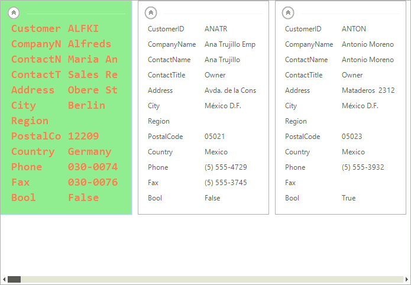
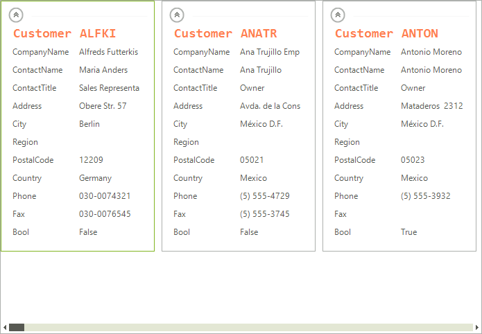

# Formatting Items

Items appearance in __RadCardView__ can be customized by making use of the __CardViewItemFormatting__ event. The following example, demonstrates how you can change the color of an item which is being selected.

>note By using this event to customize the items appearance, you should always provide an else clause,  where you reset the appearance settings which you have introduced. This is necessary since __RadCardView__ uses data virtualization, which might lead to unpredicted appearance results when items are being reused.

## Formatting the Visual Item

The appearance of the visual items can be fully customized by handling the __CardViewItemFormatting__ event. 

>caption Fig.1 Formatting the Visual Item


#### Formatting the Visual Item

{{source=..\SamplesCS\CardView\CardviewCustomizingAppearance.cs region=CardViewVisualItemFormatting}} 
{{source=..\SamplesVB\CardView\CardviewCustomizingAppearance.vb region=CardViewVisualItemFormatting}} 

````C#
Font font = new Font("Consolas", 14, FontStyle.Bold);
private void radCardView1_CardViewItemFormatting(object sender, CardViewItemFormattingEventArgs e)
{
    if (e.VisualItem.Selected)
    {
        e.VisualItem.NumberOfColors = 1;
        e.VisualItem.BackColor = Color.LightGreen;
        e.VisualItem.ForeColor = Color.Coral;
        e.VisualItem.BorderColor = Color.LightBlue;
        e.VisualItem.Font = font;
    }
    else
    {
        e.VisualItem.ResetValue(LightVisualElement.NumberOfColorsProperty, Telerik.WinControls.ValueResetFlags.Local);
        e.VisualItem.ResetValue(LightVisualElement.BackColorProperty, Telerik.WinControls.ValueResetFlags.Local);
        e.VisualItem.ResetValue(LightVisualElement.ForeColorProperty, Telerik.WinControls.ValueResetFlags.Local);
        e.VisualItem.ResetValue(LightVisualElement.BorderColorProperty, Telerik.WinControls.ValueResetFlags.Local);
        e.VisualItem.ResetValue(LightVisualElement.FontProperty, Telerik.WinControls.ValueResetFlags.Local);
    }
}

````
````VB.NET
Private font As New Font("Consolas", 14, FontStyle.Bold)
Private Sub RadCardView1_CardViewItemFormatting(sender As Object, e As CardViewItemFormattingEventArgs)
    If e.VisualItem.Selected Then
        e.VisualItem.NumberOfColors = 1
        e.VisualItem.BackColor = Color.LightGreen
        e.VisualItem.ForeColor = Color.Coral
        e.VisualItem.BorderColor = Color.LightBlue
        e.VisualItem.Font = font
    Else
        e.VisualItem.ResetValue(LightVisualElement.NumberOfColorsProperty, Telerik.WinControls.ValueResetFlags.Local)
        e.VisualItem.ResetValue(LightVisualElement.BackColorProperty, Telerik.WinControls.ValueResetFlags.Local)
        e.VisualItem.ResetValue(LightVisualElement.ForeColorProperty, Telerik.WinControls.ValueResetFlags.Local)
        e.VisualItem.ResetValue(LightVisualElement.BorderColorProperty, Telerik.WinControls.ValueResetFlags.Local)
        e.VisualItem.ResetValue(LightVisualElement.FontProperty, Telerik.WinControls.ValueResetFlags.Local)
    End If
End Sub

````

{{endregion}} 

## Formatting CardViewItiem

By handling the __CardViewItemFormatting__ event each of the individual card view items can be customized as well.

>caption Fig.2 Formatting CardViewItiem


#### Formatting CardViewItiem

{{source=..\SamplesCS\CardView\CardviewCustomizingAppearance.cs region=CardViewItemFormatting}} 
{{source=..\SamplesVB\CardView\CardviewCustomizingAppearance.vb region=CardViewItemFormatting}}  

````C#
private void radCardView1_CardViewItemFormatting1(object sender, CardViewItemFormattingEventArgs e)
{
    CardViewItem item = e.Item as CardViewItem;
    if (item != null && item.FieldName == "CustomerID")
    {
        e.Item.NumberOfColors = 1;
        e.Item.ForeColor = Color.Coral;
        e.Item.BorderColor = Color.LightBlue;
        e.Item.Font = font;
    }
    else
    {
        e.Item.ResetValue(LightVisualElement.NumberOfColorsProperty, Telerik.WinControls.ValueResetFlags.Local);
        e.Item.ResetValue(LightVisualElement.ForeColorProperty, Telerik.WinControls.ValueResetFlags.Local);
        e.Item.ResetValue(LightVisualElement.BorderColorProperty, Telerik.WinControls.ValueResetFlags.Local);
        e.Item.ResetValue(LightVisualElement.FontProperty, Telerik.WinControls.ValueResetFlags.Local);
    }
}

````
````VB.NET
Private Sub RadCardView1_CardViewItemFormatting1(sender As Object, e As CardViewItemFormattingEventArgs)
    Dim item As CardViewItem = TryCast(e.Item, CardViewItem)
    If item IsNot Nothing AndAlso item.FieldName = "CustomerID" Then
        e.Item.NumberOfColors = 1
        e.Item.ForeColor = Color.Coral
        e.Item.BorderColor = Color.LightBlue
        e.Item.Font = font
    Else
        e.Item.ResetValue(LightVisualElement.NumberOfColorsProperty, Telerik.WinControls.ValueResetFlags.Local)
        e.Item.ResetValue(LightVisualElement.ForeColorProperty, Telerik.WinControls.ValueResetFlags.Local)
        e.Item.ResetValue(LightVisualElement.BorderColorProperty, Telerik.WinControls.ValueResetFlags.Local)
        e.Item.ResetValue(LightVisualElement.FontProperty, Telerik.WinControls.ValueResetFlags.Local)
    End If
End Sub

````

{{endregion}} 

## See Also

[Getting Started]()
[Structure]()
[Visual Data Representation]()
[Custom Items]()
