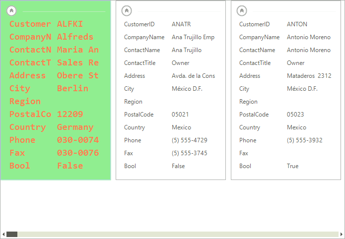
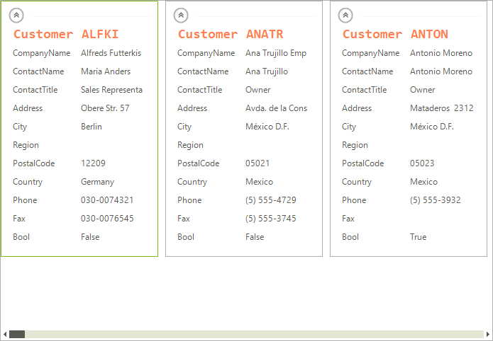

# Formatting Items

Items appearance in __RadCardView__ can be customized by making use of the __CardViewItemFormatting__ event. The following example, demonstrates how you can change the color of an item which is being selected.

>note By using this event to customize the items appearance, you should always provide an else clause,  where you reset the appearance settings which you have introduced. This is necessary since __RadCardView__ uses data virtualization, which might lead to unpredicted appearance results when items are being reused.

## Formatting the Visual Item

The appearance of the visual items can be fully customized by handling the __CardViewItemFormatting__ event. 

>caption Figure 1: Formatting the Visual Item

#### Formatting the Visual Item

<snippet id='cardview-customizing-appearance-formatting-items-cardviewvisualitemformatting-cs'/>
<snippet id='cardview-customizing-appearance-formatting-items-cardviewvisualitemformatting-vb'/>

## Formatting CardViewItiem

By handling the __CardViewItemFormatting__ event each of the individual card view items can be customized as well.

>caption Figure 2: Formatting CardViewItiem

#### Formatting CardViewItiem

<snippet id='cardview-customizing-appearance-formatting-items-cardviewitemformatting-cs'/>
<snippet id='cardview-customizing-appearance-formatting-items-cardviewitemformatting-vb'/>

## See Also

[Getting Started]()
[Structure]()
[Visual Data Representation]()
[Custom Items]()
