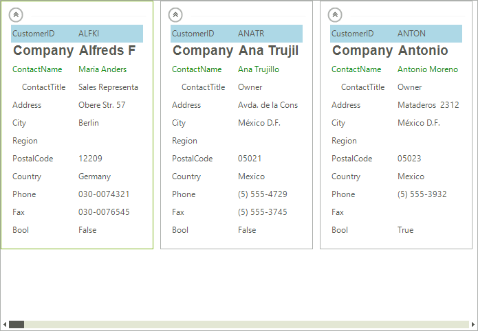

# Visual Data Representation

This article requires that readers are familiar with the workings of the [TPF]() property system.

__RadCardView__ synchronizes the most important __RadProperties__ between the different __RadCardViewItems__, meaning that a change in certain __RadProperty__ of a particular __CardViewItem__ affects the other items as well. The list below contains the properties which are synchronized by default.

* __VisualElement.BackColorProperty__
* __LightVisualElement.BackColor2Property__
* __LightVisualElement.BackColor3Property__
* __LightVisualElement.BackColor4Property__
* __LightVisualElement.NumberOfColorsProperty__
* __LightVisualElement.DrawFillProperty__
* __VisualElement.ForeColorProperty__
* __VisualElement.FontProperty__
* __LightVisualElement.TextWrapProperty__
* __LightVisualElement.DrawTextProperty__
* __LightVisualElement.TextAlignmentProperty__
* __LightVisualElement.ImageAlignmentProperty__
* __LightVisualElement.TextImageRelationProperty__
* __LightVisualElement.BorderColorProperty__
* __LightVisualElement.DrawBorderProperty__
* __LightVisualElement.BorderWidthProperty__
* __LightVisualElement.GradientStyleProperty__
* __LightVisualElement.GradientPercentageProperty__
* __LightVisualElement.GradientPercentage2Property__ 

The collection with these __RadProperties__ is static and it it accessible, therefore changes of the collection are possible. The example below adds the __LightVisualElement.VisibilityProperty__ and sets others in order to customize the appearance of the items.

>caption Figure 1: Modifying RadProperties

#### Formatting the Visual Item

<snippet id='cardview-customizing-appearance-visual-data-representation-customizeappearance-cs'/>
<snippet id='cardview-customizing-appearance-visual-data-representation-customizeappearance-vb'/>

## See Also

[Getting Started]()
[Structure]()
[Formatting Items]()
[Custom Items]()

