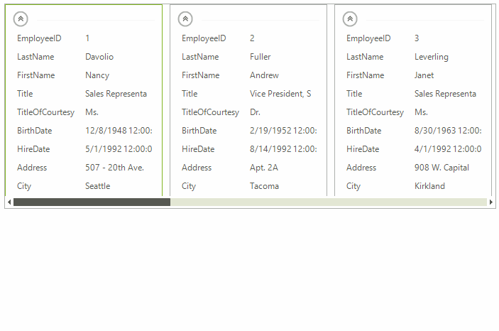

# Switching Editors

When edit operation is about to begin, the __EditorRequired__ event is fired. By using this event, you can replace the default text box editor with one of the four built-in editors that __RadCardView__ provides: __ListViewTextBoxEditor__, __ListViewDropDownListEditor__, __ListViewSpinEditor__, __ListViewDateTimeEditor__. You can also provide a custom instance as an editor. The default editor used by __RadCardView__ is __ListViewTextBoxEditor__.

The following example shows how you can change the editor type:

>caption Figure 1: Changed Editors

#### Changing Editor Type

<snippet id='cardview-editors-switching-editors-changingeditortype-cs'/>
<snippet id='cardview-editors-switching-editors-changingeditortype-vb'/>

# See Also

* [Editors Overview]()
* [Custom Items]()
* [Formatting Items]()
