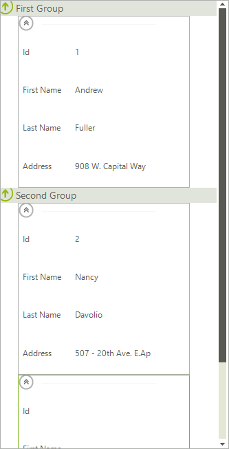
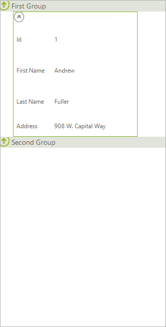

# Filtering

__RadCardView__ allows filtering applied to its __CardViewItems__. To enable filtering use the __EnableFiltering__ property of the control.

#### Enable Filtering

<snippet id='cardview-features-filtering-enablefiltering-cs'/>
<snippet id='cardview-features-filtering-enablefiltering-vb'/>

Once the filtering is enabled, we have to create a new __FilterDescriptor__ and assign its __PropertyName__, __FilterOperator__ and __SearchCriteria__. First, let’s filter the items by their value and look for items containing with `Capital`.

#### Filter by Column

<snippet id='cardview-features-filtering-filterdescriptor-cs'/>
<snippet id='cardview-features-filtering-filterdescriptor-vb'/>

>caption Figure 1: Before

>caption Figure 2: After

