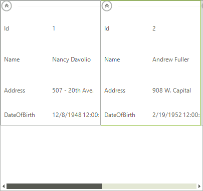

# Binding to Data

Data binding provides a way to bind the display of data in a __RadCardView__ to a data source. Three properties control the data binding:

* __DataSource__: Specifies the source of the data to be bound

* __DisplayMember__: Specifies the particular data to be displayed in a __RadCardView__

* __ValueMember__: Specifies the particular data to be returned as the value of a __RadCardView__

## Design Time Data Binding

A complete tutorial for connecting to the *Northwind* database from the Visual Studio designer in available in the [Getting Started]() article.

## Data Binding Programatically

The example below will demonstrate how to bind __RadCardView__ to a collection of models. As a result the control will automatically create __CardViewItem__ objects for all public properties of the model.

>caption Fig. 1: RadCardView Bound at Run-Time


#### Bind RadCardView

{{source=..\SamplesCS\CardView\CardViewDataBindingProgramatically.cs region=BindRadCardView}} 
{{source=..\SamplesVB\CardView\CardViewDataBindingProgramatically.vb region=BindRadCardView}}
````C#
BindingList<CardViewModel> dataSource = new BindingList<CardViewModel>()
{
    new CardViewModel("1", "Nancy Davolio","507 - 20th Ave. E.Apt. 2A", DateTime.Parse("12/8/1948", CultureInfo.InvariantCulture)),
    new CardViewModel("2", "Andrew Fuller","908 W. Capital Way", DateTime.Parse("2/19/1952", CultureInfo.InvariantCulture)),
    new CardViewModel("3", "Janet Leverling","722 Moss Bay Blvd.", DateTime.Parse("8/30/1963", CultureInfo.InvariantCulture)),
    new CardViewModel("4", "Margaret Peacock","110 Old Redmond Rd.", DateTime.Parse("9/19/1937", CultureInfo.InvariantCulture))
};
this.radCardView1.DataSource = dataSource;

````
````VB.NET
Dim dataSource As New BindingList(Of CardViewModel)() From {
    New CardViewModel("1", "Nancy Davolio", "507 - 20th Ave. E.Apt. 2A", DateTime.Parse("12/8/1948", CultureInfo.InvariantCulture)),
    New CardViewModel("2", "Andrew Fuller", "908 W. Capital Way", DateTime.Parse("2/19/1952", CultureInfo.InvariantCulture)),
    New CardViewModel("3", "Janet Leverling", "722 Moss Bay Blvd.", DateTime.Parse("8/30/1963", CultureInfo.InvariantCulture)),
    New CardViewModel("4", "Margaret Peacock", "110 Old Redmond Rd.", DateTime.Parse("9/19/1937", CultureInfo.InvariantCulture))
}
Me.RadCardView1.DataSource = dataSource

````


{{endregion}} 

#### Sample Data Object

{{source=..\SamplesCS\CardView\CardViewDataBindingProgramatically.cs region=SampleDataObject}} 
{{source=..\SamplesVB\CardView\CardViewDataBindingProgramatically.vb region=SampleDataObject}}
````C#
public class CardViewModel : INotifyPropertyChanged
{
    private string id;
    private string name;
    private string address;
    private DateTime dateOfBirth;
    public event PropertyChangedEventHandler PropertyChanged;
    public CardViewModel(string id, string name, string address, DateTime dateOfBirth)
    {
        this.id = id;
        this.name = name;
        this.address = address;
        this.dateOfBirth = dateOfBirth;
    }
    public string Id
    {
        get
        {
            return this.id;
        }
        set
        {
            if (this.id != value)
            {
                this.id = value;
                OnPropertyChanged("Id");
            }
        }
    }
    public string Name
    {
        get
        {
            return this.name;
        }
        set
        {
            if (this.name != value)
            {
                this.name = value;
                OnPropertyChanged("Name");
            }
        }
    }
    public string Address
    {
        get
        {
            return this.address;
        }
        set
        {
            if (this.address != value)
            {
                this.address = value;
                OnPropertyChanged("Address");
            }
        }
    }
    public DateTime DateOfBirth
    {
        get
        {
            return this.dateOfBirth;
        }
        set
        {
            if (this.dateOfBirth != value)
            {
                this.dateOfBirth = value;
                OnPropertyChanged("DateOfBirth");
            }
        }
    }
    protected virtual void OnPropertyChanged(string propertyName)
    {
        if (PropertyChanged != null)
        {
            PropertyChanged(this, new PropertyChangedEventArgs(propertyName));
        }
    }
}

````
````VB.NET
Public Class CardViewModel
    Implements INotifyPropertyChanged
    Private m_id As String
    Private m_name As String
    Private m_address As String
    Private m_dateOfBirth As DateTime
    Public Event PropertyChanged As PropertyChangedEventHandler
    Public Sub New(id As String, name As String, address As String, dateOfBirth As DateTime)
        Me.m_id = id
        Me.m_name = name
        Me.m_address = address
        Me.m_dateOfBirth = dateOfBirth
    End Sub
    Public Property Id() As String
        Get
            Return Me.m_id
        End Get
        Set(value As String)
            If Me.m_id <> value Then
                Me.m_id = value
                OnPropertyChanged("Id")
            End If
        End Set
    End Property
    Public Property Name() As String
        Get
            Return Me.m_name
        End Get
        Set(value As String)
            If Me.m_name <> value Then
                Me.m_name = value
                OnPropertyChanged("Name")
            End If
        End Set
    End Property
    Public Property Address() As String
        Get
            Return Me.m_address
        End Get
        Set(value As String)
            If Me.m_address <> value Then
                Me.m_address = value
                OnPropertyChanged("Address")
            End If
        End Set
    End Property
    Public Property DateOfBirth() As DateTime
        Get
            Return Me.m_dateOfBirth
        End Get
        Set(value As DateTime)
            If Me.m_dateOfBirth <> value Then
                Me.m_dateOfBirth = value
                OnPropertyChanged("DateOfBirth")
            End If
        End Set
    End Property
    Protected Overridable Sub OnPropertyChanged(propertyName As String)
        RaiseEvent PropertyChanged(Me, New PropertyChangedEventArgs(propertyName))
    End Sub
    Public Event PropertyChanged1(sender As Object, e As PropertyChangedEventArgs) Implements INotifyPropertyChanged.PropertyChanged
End Class

````


{{endregion}} 

## See Also

* [Structure]()
* [Design Time]()
* [Getting Started]()
