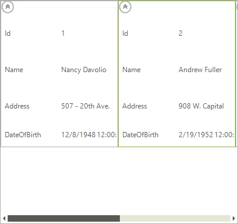

# Binding to Data

Data binding provides a way to bind the display of data in a __RadCardView__ to a data source. Three properties control the data binding:

* __DataSource__: Specifies the source of the data to be bound

* __DisplayMember__: Specifies the particular data to be displayed in a __RadCardView__

* __ValueMember__: Specifies the particular data to be returned as the value of a __RadCardView__

## Design Time Data Binding

A complete tutorial for connecting to the *Northwind* database from the Visual Studio designer in available in the [Getting Started]() article.

## Data Binding Programatically

The example below will demonstrate how to bind __RadCardView__ to a collection of models. As a result the control will automatically create __CardViewItem__ objects for all public properties of the model.

>caption Figure 1: RadCardView Bound at Run-Time

#### Bind RadCardView

<snippet id='cardview-populating-with-data-binding-to-data-bindradcardview-cs'/>
<snippet id='cardview-populating-with-data-binding-to-data-bindradcardview-vb'/>

#### Sample Data Object

<snippet id='cardview-populating-with-data-binding-to-data-sampledataobject-cs'/>
<snippet id='cardview-populating-with-data-binding-to-data-sampledataobject-vb'/>

## See Also

* [Structure]()
* [Design Time]()
* [Getting Started]()
