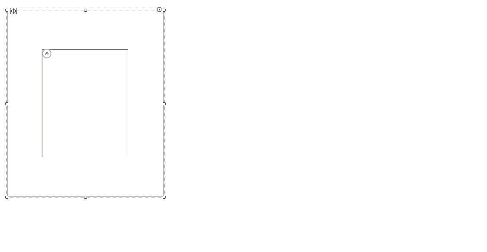
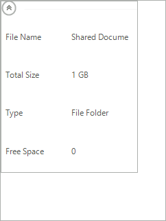
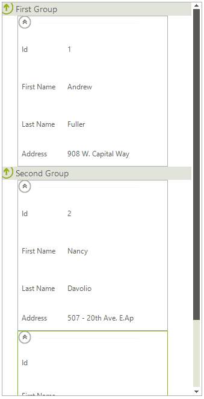

# Unbound Mode

## Design Time Adding Items

Unbound data can be populated in the Visual Studio designer by using the __Edit Columns__ and __Edit Items__ groups of the control's Smart Tag. The value of the label is determined by the __HeaderText__ property of the column. Each of the added items exposes a __SubItems__ collection which can be filled with string data corresponding to each of the columns. The short video below sets up the control with one __CardViewItem__ having four columns and four editor values.

>caption Figure 1: Add Items at Design Time

After you run the application, the result should be similar to the following image.

>caption Figure 2: Added Items at Design Time

## Populating Data Programatically

__RadCardView__ can also be set up to display data added at run-time. The following example will also demonstrate how custom grouping can be achieved. 

>caption Figure 3: Add Grouped Items at Run Time

### Adding Columns

The columns of __RadCardView__ are stored in a collection that is accessible through the __Columns__ property. Columns can be added to __RadCardView__ using one of the three overloads of the __Add__ method as it is shown below. Each column must have unique name because columns are distinguished by their __Name__ property. 

#### Adding columns

<snippet id='cardview-populating-with-data-unbound-mode-addcolumns-cs'/>
<snippet id='cardview-populating-with-data-unbound-mode-addcolumns-vb'/>

### Adding Items and Populating Cells

The items of __RadCardView__ are stored in a collection that is also accessible through its __Items__ property. Items can be added to __RadCardView__ using one of the overloads of the __Add__ method. You can set cell values to the items of __RadCardView__ using their indexers. The keys can be either the index of the column, the name of the column, or the column itself.

#### Adding items

<snippet id='cardview-populating-with-data-unbound-mode-additems-cs'/>
<snippet id='cardview-populating-with-data-unbound-mode-additems-vb'/>

#### Populating cells

<snippet id='cardview-populating-with-data-unbound-mode-populatecells-cs'/>
<snippet id='cardview-populating-with-data-unbound-mode-populatecells-vb'/>

>note To use these indexers the item must have a valid owner e.g. it first has to be added to the __Items__ collection of the __RadCardView__.
>

## Adding Groups

Aside from using __GroupDescriptors__, custom groups can also be added to __RadCardView__. This is done by using the __Add__ method of the __Groups__ collection of RadListView.

#### Adding groups

<snippet id='cardview-populating-with-data-unbound-mode-addgroups-cs'/>
<snippet id='cardview-populating-with-data-unbound-mode-addgroups-vb'/>

In order to assign an item to a group, you should set the item’s __Group__ property:

#### Assign item to a group

<snippet id='cardview-populating-with-data-unbound-mode-assignitemtoagroup-cs'/>
<snippet id='cardview-populating-with-data-unbound-mode-assignitemtoagroup-vb'/>

In order to enable this kind of grouping the __EnableCustomGrouping__ property needs to be set to *true*. In order to display the groups the __ShowGroups__ property needs to be set to *true*.
		

