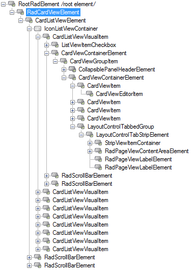
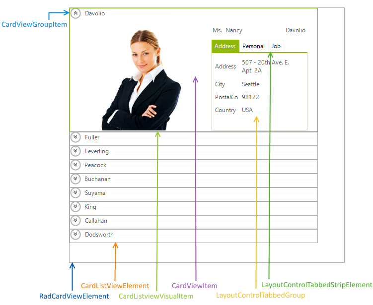

# Structure

The __CardListViewVisualItem__ element extends the __IconListViewVisualItem__ class used by __RadListView__ control. Hence, most of the functionality already defined for __RadListView__ when set up in *IconsView* will also be valid for the __RadCardView__ control. __RadLayoutContol__ is responsible for the setting up and arranging the elements of __RadCardView__ in a complex layout always adjusting to the available space.

>caption Fig.1 RadCardView`s Element Hierarchy

The element hierarchy and structure may vary depending on the current settings and the configuration of the layout control. 

>caption Fig.2 RadCardView`s Structure

* __RadCardViewElement__: Represents the main element of __RadCardView__.
* __CarListViewElement__: Container element of the control.
* __CardListViewVisualItem__: A single __RadCardView__ visual item.
* __CardViewItem__: A particular __RadCardView__ item.
* __LayoutControlTabbedGrouped__: Represents a layout control container of the tabbed groups.
* __LayoutControlTabbedStripElement__: Tabbed strip element of the layout control.
* __CardViewGroupItem__: A single grouped item.

## See Also

* [Design Time]()
* [Getting Started]()
* [ListView]()
* [LayoutControl]()
