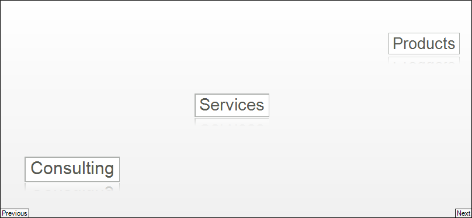

# Data Binding

To bind data to __RadCarousel__:

* Set the __DataSource__ property.
          
* Handle the __NewCarouselItemCreating__ event. In the event handler, create a __RadItem__ descendant instance.
          
* Handle the __ItemDataBound__ event. In this event you have access to both the data item and to the __RadItem__ instance.
          
This same pattern holds true, regardless of the type of data being bound to.

## Example

The example below creates a generic list of an object called "Feature". "Feature" has "ID" and "Name" properties. In the __NewCarouselItemCreating__ event handler, `RadButtonElement` instances are created. In the __ItemDataBound__ event handler, the button text is assigned the "Name" property of the "Feature" object. The "ID" property of the "Feature" object is stored in the `RadButtonElement` __Tag__ property for later use in the `Click` event handler.

#### The Features Object

<snippet id='carousel-data-binding-creategenericlistclass-cs'/>
<snippet id='carousel-data-binding-creategenericlistclass-vb'/>

 

#### Binding RadCarousel to Generic List

<snippet id='carousel-data-binding-bindingcarousel-cs'/>
<snippet id='carousel-data-binding-bindingcarousel-vb'/>

 

# See Also

 * [Customize Appearance]()
 * [Working with items]()
 * [Data Binding]()
 * [Carousel Path]()
