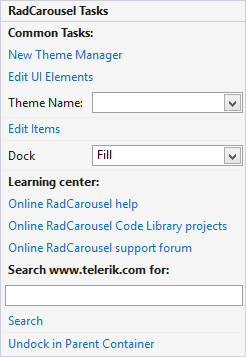
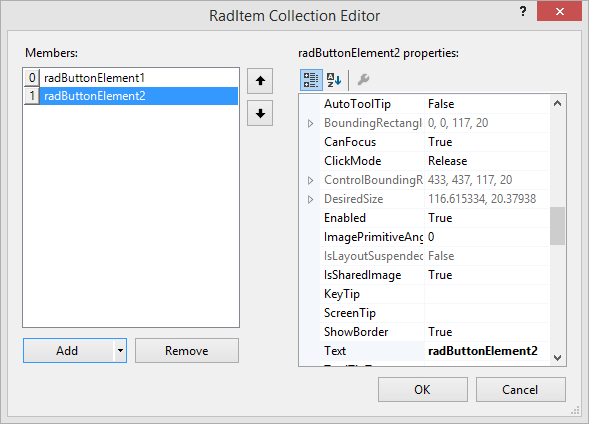

# Smart Tag

The __Smart Tag__ of __RadCarousel__ lets you quickly access common tasks involved with managing items, customizing appearance or setting the theme.

>caption Figure 1: The Smart Tag of RadCarousel

* __Edit Items:__ Opens the __RadItem__ collection editor, in it you can add different types of __RadElements__: 
    

    You can add as many items as you want. Use the __Up__ and __Down__ buttons next to the items list to change the items order. 

    Use the properties editor to set item-specific properties such as __ToolTip__, caption (__Text__ property), etc.

* __New Theme Manager:__ Adds a new __RadThemeManager__ component to the form.

* __Edit UI elements:__ Opens a dialog that displays the __Element Hierarchy Editor.__ This editor lets you browse all the elements in the control.

* __Theme Name:__ Select a theme name from the drop down list of themes available for that control. Selecting a theme allows you to change all aspects of the controls visual style at one time.

* __Learning Center:__ Navigate to the Telerik help, code library projects or support forum.

* __Search:__ Search the Telerik site for a given string.

# See Also

 * [RadCarousel Properties]()
 * [Working with items]()
 * [Data Binding]()
 * [Carousel Path]()
