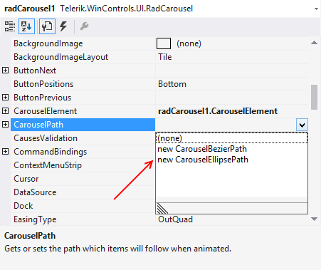

# Setting Bezier Path Design-Time

You can set the bezier path for the carousel using the Visual Studio designer. 

1. Drag the __RadCarousel__ control in your form. 

2. In Properties, set __CarouselPath__ to __newCarouselBezierPath:__

	

3. Drag the four control points and set the bezier as desired:

	

>note  __Note__ : You can arrange the points only in 2D. The Z coordinate (if needed) should be set programmatically.
>You can drag the bezier points over the whole designer area, i.e. you are not limited to the form only.
>

# See Also

 * [RadCarousel Properties]()
 * [Working with items]()
 * [Data Binding]()
 * [Carousel Path]()

