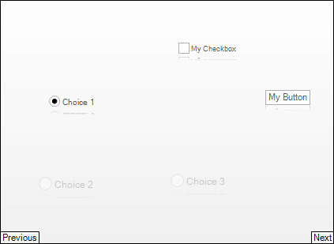

# Carousel Items
 
You can add items to __RadCarousel__ control by using the __Items__ collection (programmatically or design-time), or by [binding to a data source](). You can use __RadItem__ descendants to populate the __RadCarousel.Items__ collection, for example __RadLabelElement__ or __RadButtonElement__.

### Adding Carousel Items

To add items to the carousel without [data binding](), use the __Add__ method of the carousel collection. The example below adds a number of different RadItem types.

#### Adding Items 

<snippet id='carousel-using-radcarousel-carousel-items-carouselitems-cs'/>
<snippet id='carousel-using-radcarousel-carousel-items-carouselitems-vb'/>

 
 
### Deleting Items

To delete an entry from the carousel __Items__ collection, use the __Remove__ or __RemoveAt__ methods. __Remove__ takes the __RadItem__ instance to be deleted and __RemoveAt__ takes the index position of the item to be deleted:
        
#### Deleting Carousel Items 

<snippet id='carousel-using-radcarousel-carousel-items-carouseldeletingitems-cs'/>
<snippet id='carousel-using-radcarousel-carousel-items-carouseldeletingitems-vb'/>

 

# See Also

 * [Customize Appearance]()
 * [Data Binding]()
 * [Carousel Path]()
