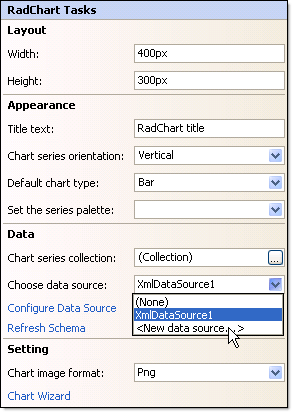
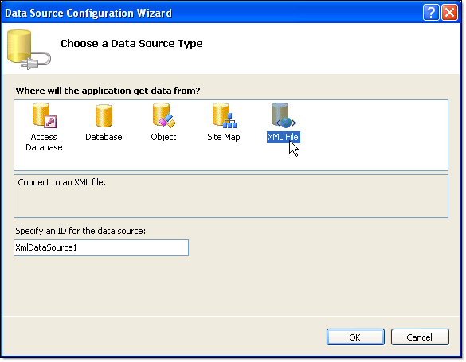
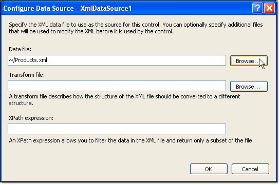

# Binding to XML at Design-Time using an XMLDataSource

## 

To bind to XML at design-time using an [XMLDataSource](http://msdn2.microsoft.com/en-us/library/system.web.ui.webcontrols.xmldatasource.aspx) control:

1. Click the RadChart [Smart Tag]() *Choose Data Source* | *< New Data Source >*. 

	>caption 

	

1. From the "Choose a data source type" page of the wizard select "XML File" and click "OK". 

	>caption 

	

1. Using the Browse button locate and select the XML file. Click OK. 

	>caption 

	

