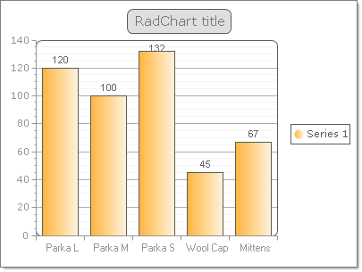

# Data Binding RadChart to a Generic List of Objects


## 

You can bind to a [generic lists](http://msdn2.microsoft.com/en-us/library/6sh2ey19.aspx) of objects that have multiple properties. The example below binds to a list of "Product" objects that contain two properties, one property for "Name" and a second for "QuantityInStock". The Y axis binds to the QuantityInStock and the X axis label binds to the "Name" property.


>caption 



The Product object is defined with a constructor that passes both Name and QuantityInStock:  

{{source=..\SamplesCS\Chart\DataBindingToGenericListOfObject.cs region=product}} 
{{source=..\SamplesVB\Chart\DataBindingToGenericListOfObject.vb region=product}} 

````C#
public class Product
{
    public Product(string name, int quantityInStock)
    {
        _name = name;
        _quantityInStock = quantityInStock;
    }
    private string _name;
    public string Name
    {
        get { return _name; }
        set { _name = value; }
    }
    private int _quantityInStock;
    public int QuantityInStock
    {
        get { return _quantityInStock; }
        set { _quantityInStock = value; }
    }
}

````
````VB.NET
Public Class Product
    Public Sub New(ByVal name As String, ByVal quantityInStock As Integer)
        _name = name
        _quantityInStock = quantityInStock
    End Sub
    Private _name As String
    Public Property Name() As String
        Get
            Return _name
        End Get
        Set(ByVal value As String)
            _name = value
        End Set
    End Property
    Private _quantityInStock As Integer
    Public Property QuantityInStock() As Integer
        Get
            Return _quantityInStock
        End Get
        Set(ByVal value As Integer)
            _quantityInStock = value
        End Set
    End Property
End Class

````

{{endregion}} 


After the Product object is defined the following steps configure and bind to the generic List:

1. A generic List of Product objects is created and assigned to the __RadChart__ __DataSource__ property.   


1. The __DataYColumn__ property of the series is assigned the numeric "QuantityInStock" property of the Product object.  


1. The __XAxisDataLabelsColumn__ is assigned the "Name" property of the the Product object.  


1. The __RadChart__ DataBind() method is called. 

{{source=..\SamplesCS\Chart\DataBindingToGenericListOfObject.cs region=bindingToObject}} 
{{source=..\SamplesVB\Chart\DataBindingToGenericListOfObject.vb region=bindingToObject}} 

````C#
RadChart radChart1;
public DataBindingToGenericListOfObject()
{
    InitializeComponent();
    radChart1 = new RadChart();
    this.Controls.Add(radChart1);
   
    List<Product> products = new List<Product>();
    products.Add(new Product("Parka L", 120));
    products.Add(new Product("Parka M", 100));
    products.Add(new Product("Parka S", 132));
    products.Add(new Product("Wool Cap", 45));
    products.Add(new Product("Mittens", 67));
    radChart1.DataSource = products;
    radChart1.DataBound += new EventHandler<EventArgs>(radChart1_DataBound);
}
void radChart1_DataBound(object sender, EventArgs e)
{
    radChart1.Series[0].DataYColumn = "QuantityInStock";
    radChart1.PlotArea.XAxis.DataLabelsColumn = "Name";
    radChart1.PlotArea.XAxis.Appearance.TextAppearance.TextProperties.Font = new System.Drawing.Font("Ariel", 8);
}

````
````VB.NET
Dim RadChart1 As New RadChart
Public Sub New()
    InitializeComponent()
    Me.Controls.Add(RadChart1)
    Dim products As New List(Of Product)()
    products.Add(New Product("Parka L", 120))
    products.Add(New Product("Parka M", 100))
    products.Add(New Product("Parka S", 132))
    products.Add(New Product("Wool Cap", 45))
    products.Add(New Product("Mittens", 67))
    RadChart1.DataSource = products
    AddHandler RadChart1.DataBound, AddressOf RadChart1_DataBound
End Sub
Private Sub RadChart1_DataBound(ByVal sender As Object, ByVal e As EventArgs)
    RadChart1.Series(0).DataYColumn = "QuantityInStock"
    RadChart1.PlotArea.XAxis.DataLabelsColumn = "Name"
    RadChart1.PlotArea.XAxis.Appearance.TextAppearance.TextProperties.Font = New System.Drawing.Font("Ariel", 8)
End Sub

````

{{endregion}} 


