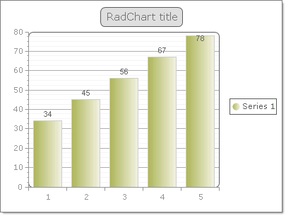

# Data Binding RadChart to a Generic List of Simple Types


The example below is the result of binding a [generic List<>](http://msdn2.microsoft.com/en-us/library/6sh2ey19.aspx) of double to the __RadChart__ __DataSource__ property and calling the DataBind() method.
>caption 




{{source=..\SamplesCS\Chart\DataBindingToGenericListOfSimpleTypes.cs region=bindToGenericListOfSimpleTypes}} 
{{source=..\SamplesVB\Chart\DataBindingToGenericListOfSimpleTypes.vb region=bindToGenericListOfSimpleTypes}} 

````C#
List<double> chartData = new List<double>();
chartData.Add(34);
chartData.Add(45);
chartData.Add(56);
chartData.Add(67);
chartData.Add(78);
radChart1.DataSource = chartData;

````
````VB.NET
Dim chartData As New List(Of Double)()
chartData.Add(34)
chartData.Add(45)
chartData.Add(56)
chartData.Add(67)
chartData.Add(78)
RadChart1.DataSource = chartData

````

{{endregion}} 


