# Quick Start: Create a Data Bound Chart

This Quick Start tutorial is designed to have you quickly up and running with a working data bound RadChart. In the tutorial you will populate the chart by binding to a data source and will modify several properties that affect chart appearance.
     

## Create a Windows Application

1. From the Visual Studio __File__ menu select __New | Project__.

1. Select the "Windows Application" and enter a location path for the project.
 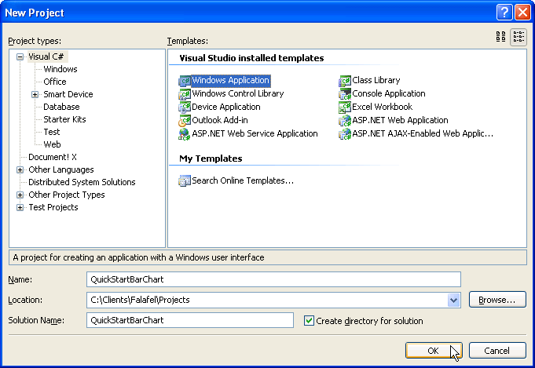

1. From the Toolbox drag a RadChart component to the form. The project should now look like the figure below.
 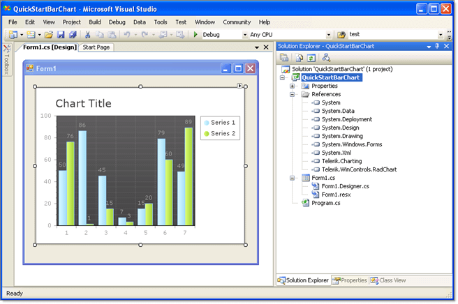

## Configuring the Data Source

1. From the RadChart Smart Tag menu select the __Data Choose Data Source__ drop down and click the __Add Project Data Source__ item.
 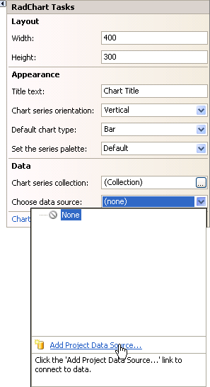

1. On the __Choose a Data Source Type__ page of the __Data Source Configuration Wizard__ select __Database__ and click the __Next__ button.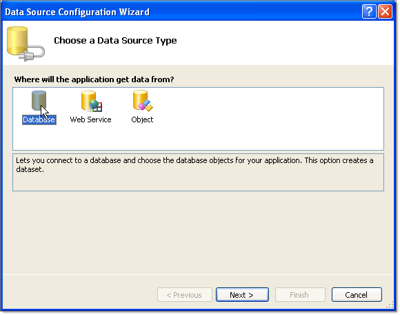

1. On the Choose Your Data Connection page click the __New Connection button__. This will display the __Add Connection. Enter "(local)\SQLEXPRESS"__ in the __Server name__ drop down list. Select "AdventureWorksT" from the __Select or enter a database name__ drop down list. Optionally, you can click the Test Connection button to verify your settings so far. Click the __OK__ button to close the dialog.
 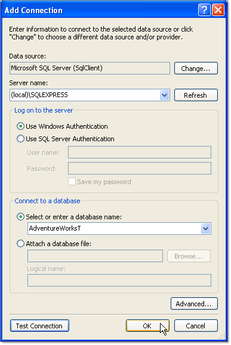

1. On the __Choose Your Data Connection__ page of the wizard click the __Next__ button.
 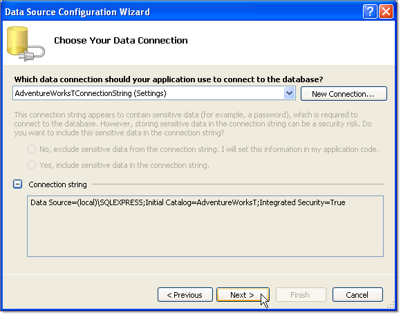

1. On the __Choose Your Database Objects__ page of the wizard locate the ProductInventory table and select the Quantity field. Click the __Finish__ button. Note: In following steps this information will be overwritten and is just a place holder.
 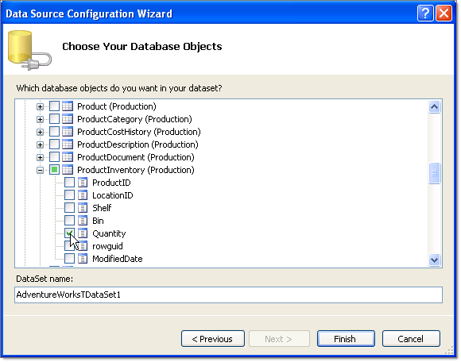

1. Three new components will appear in the component tray below the form designer: adventureWorksTDataSet, productInventoryBindingSource and productInventoryTableAdapter. Right click the table adapter and select __Edit Queries in DataSet Designer__.
 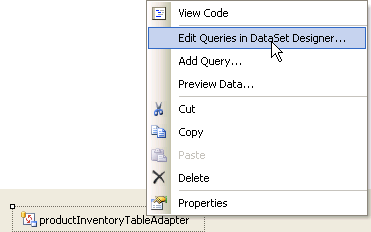

1. In the __DataSet Designer__ right click the ProductInventoryTableAdapter and select __Configure__.
 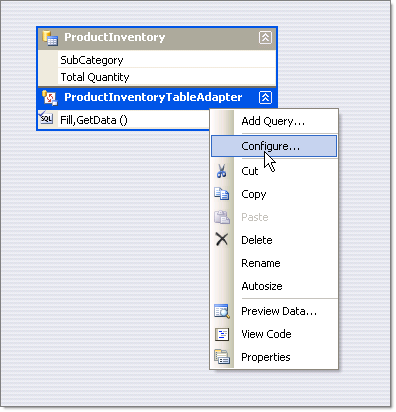

1. Enter the following SQL into the edit space provided in the __Enter a SQL Statement__ page of the __TableAdapter Configuration Wizard__.
 
1. Click the __Finish__ button.
 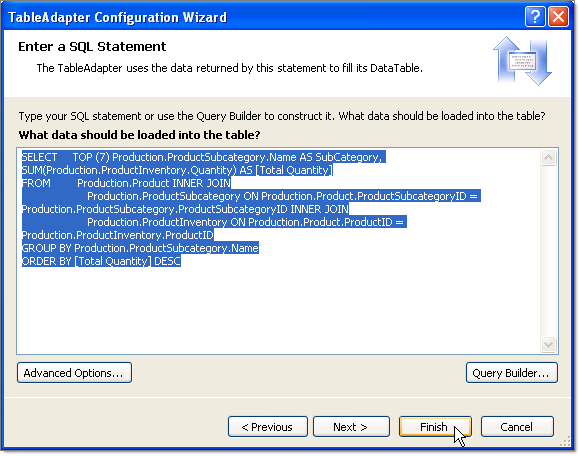

## Format the Chart Using the SmartTag

1. From the __Smart Tag__ select the __RadChart Wizard__. Select the __Type__ tab and click the __Horizontal Orientation__ radio button.
 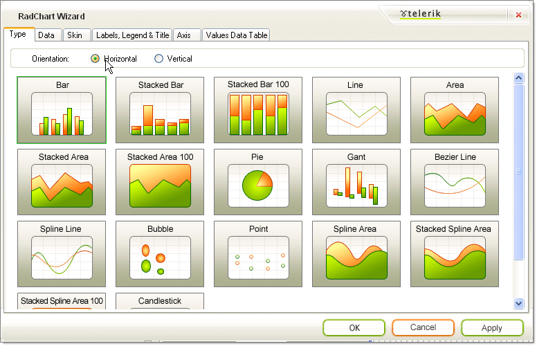

1. On the RadChart Wizard __Data__ tab __Axis Labels__ choose the "SubCategory" from the X-Axis drop down.
 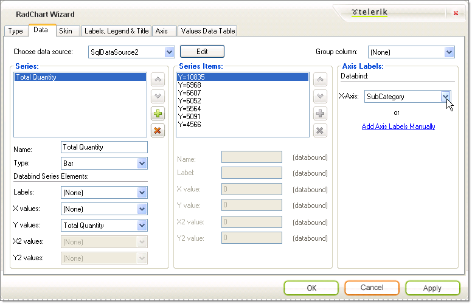

1. On the RadChart Wizard __Skin__ tab select the "Deep Blue" skin.
 

1. On the RadChart Wizard __Labels, Legend and Title__ set the __Legend Alignment__ to "Right" and __Title Text__ to "Products".
 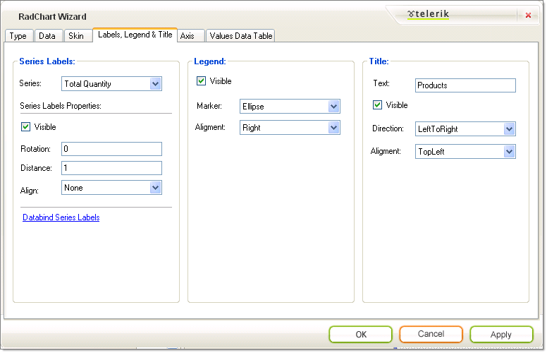

1. The X-Axis labels bound to the "SubCategory" column are too wide and will overflow. To make the plot area smaller to make room, set the __PlotArea.Appearance.Dimensions.Margins.Left__ to "50%".
 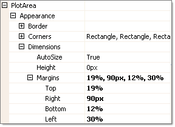

1. The finished chart should look like the screenshot below.
 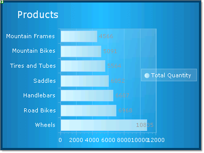
