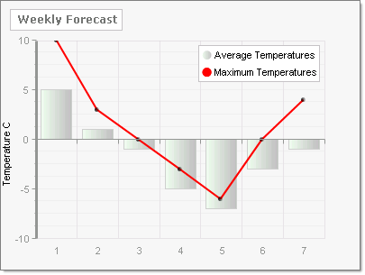

# How Do I extend the Displayable Area for YAxis Data?

## 

"My data touches the upper boundary of the plot area but that makes the data harder to see. How do I extend the viewable area along the YAxis?"

Assign the YAxis __AxisMode__ property.  By default the __ChartYAxisMode__ property value is Normal and the YAxis data fills the available space.

myChart.PlotArea.YAxis.AxisMode = ChartYAxisMode.Normal;

CS

>caption 

If you set the __ChartYAxisMode__ to __Extended,__ additional area is placed above the highest data point to make the chart easier to read.

myChart.PlotArea.YAxis.AxisMode = ChartYAxisMode.Extended;

CS
>caption 

