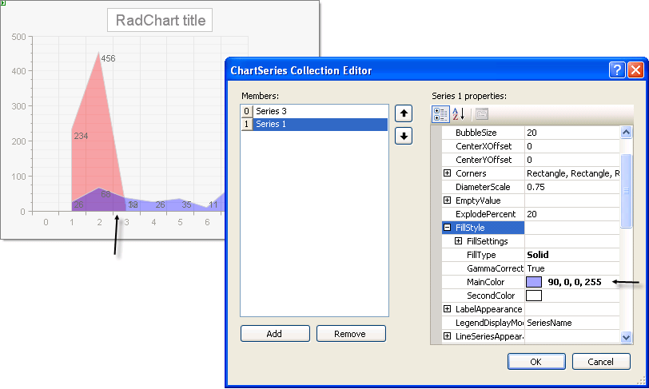

# How do I make colors display with partial transparency?

## 

"If I have several series that overlap and I want partial transparency so I can see all series at one time (without it being a stacked chart), how do I set a color to be transparent?" 

When defining the color, add an "alpha" channel, i.e. a percentage of transparency to the beginning of the array that defines the color.  For example: 

255, 0, 0 = Red

80, 255, 0, 0 = Red that is 80% transparent.

In the example below both series have a main color with a transparency of 90%.

>caption 

