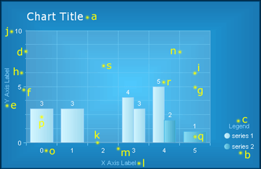

# Styling Chart Elements

RadChart offers a set of properties to modify the look and feel of its elements. See those elements marked on the image below consider the table showing where their customization properties are located in the chart properties grid.
>caption 

| Element | Properties |
| ------ | ------ |
|a. Chart Title| Elements -> ChartTitle -> Appearance   Elements -> ChartTitle -> TextBlock|
|b. Legend|Elements -> Legend -> Appearance|
|c. Legend TextBlock (Legend Title)|Elements -> Legend -> TextBlock|
|d. Y Axis|PlotArea -> YAxis -> Appearance|
|e. Y Axis Label (Axis Title)|PlotArea -> YAxis -> AxisLabel|
|f. Y Axis Major Tick|PlotArea -> YAxis -> Appearance -> MajorTick|
|g. Y Axis Major GridLine|PlotArea -> YAxis -> Appearance -> MajorGridLines|
|h. Y Axis Minor Tick|PlotArea -> YAxis -> Appearance -> MinorTicк|
|i. Y Axis Minor GridLine|PlotArea -> YAxis -> Appearance -> MinorGridLines|
|j. Y Axis Label (Digit)|PlotArea -> YAxis -> Appearance -> LabelAppearance|
|k. X Axis|PlotArea -> XAxis -> Appearance|
|l. X Axis Label (Axis Title)|PlotArea -> XAxis -> AxisLabel|
|m. X Axis Major Tick|PlotArea -> XAxis -> Appearance -> MajorTick|
|n. X Axis Major GridLine|PlotArea -> XAxis -> Appearance -> MajorGridLines|
|o. X Axis Label (Digit)|PlotArea -> XAxis -> Appearance -> LabelAppearance|
|p. Series 1|Data -> Series -> [series name] -> Appearance -> Appearance|
|q. Series 2|Data -> Series -> [series name] -> Appearance -> Appearance|
|r. Series Item Label|Data -> Series -> [series name] -> Appearance -> Appearance -> TextAppearance|
|s. PlotArea|Elements -> PlotArea -> Appearance|

## Common Appearance Properties

All chart elements have common appearance settings, which are:

* __Border__ – border width, color and style

* __Corners__ – corner style and size

* __Dimensions__ – width, height, margin, padding

* __FillStyle__ – background color, image and gradients

* __Position__

* __Shadow__ – color, distance and position

* __Visible__ – true or false
