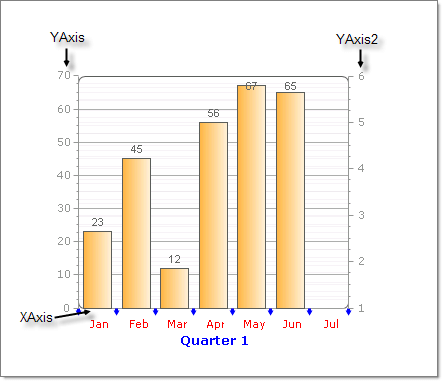
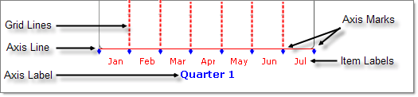
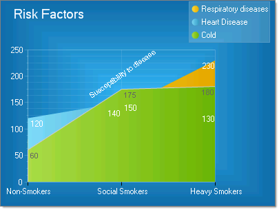

# Axes

X and Y axes are included in all chart types but the [Pie]() chart. Typically the __YAxis__ displays values and the __XAxis__ displays categories.  For example, the __YAxis__ might show "items sold" or "revenue", while the __XAxis__ might show "Months" or "Products". The X axis can also display values. A second "Y" axis property __YAxis2__ is provided for displaying a second scale of measurements. 
>caption 

## Axis Elements

Each axis has: 

* Grid lines display perpendicular to the axis covering the plot area. 

* Axis line 

* Axis label 

* Axis marks along the axis line 

* Item labels below the axis line 

The example below shows a sample X-axis with several appearance related properties customized. 
>caption 

The RadChart __PlotArea__ property has sub properties __XAxis__, __YAxis__ and __YAxis2__. Each axis object has an __Appearance__ property used to make the customizations shown above.  Some significant axis appearance related properties are: 

* The __LabelAppearance__ property includes sub properties that control the axis label __visibility__, __Border__, __Corners__, __Dimensions__, __FillStyle__, __Position__ and __Shadow__. 

* __MajorGridlines__ controls the appearance of grid lines displaying over the plot area including __visibility__, __Cap__, __Color__, __PenStyle__ and __Width__.
            

* __TextAppearance__ handles the axis item label text, most notably TextAppearance.TextProperties controls font properties and color.

>note Axis properties can be set from the Properties Window of Visual Studio, in the XML configuration file, or through the API. Properties for the X and Y axis are identical except where noted.
>

##  Formatting Axis

You can modify the overall appearance of an axes by changing the __AutoScale__ and __AutoShrink__ properties.  These properties when set to true cause the axis to expand and shrink to accommodate dynamically added and removed items. This is useful when the number of items changes on-the-fly.Turn __AutoScale__ off if you want complete control over labeling of an axis.

## Formatting Axis Labels
>caption 

To display a range of values along an axis, specify for the __ChartAxis__ a starting __MinValue__, an ending __MaxValue__, and a __Step__. In the example above, the YAxis has a __MinValue__ of "0", a __MaxValue__ of "250" and a __Step__ of "50." The X axis is labeled explicitly by setting PlotArea.XAxis properties:  

* __AutoScale__ = False 

* __MaxValue__ = 3 

* __MinValue__ = 1 

* __Step__ = 1 

* __Visible__ = True 

* __Items__ is populated with with 3 __ChartAxisItem__ objects where the Appearance.Text property contains "Non-Smokers", "Social Smokers" and "Heavy Smokers".

You can control the size and position of the labels using the axis Appearance.LabelAppearance __Dimensions__ and __Position__ properties.

DataRelatedPropertiesAxis

## Unique YAxis and YAxis2 Properties

__AxisMode__: AxisMode can be __Normal__ (the default) or __Extended__. __Extended__ mode provides buffer space above the largest value for best visual formatting.

__ScaleBreaks__: The ScaleBreaks feature allows you to "break off" large chunks of the axis so that graphs with large amplitude are easier to read. ScaleBreaks are available for both YAxis and YAxis2 of the plot area. By default __Enabled__ is false so scale breaks do not display. Set the maximum number of breaks using __MaxBreaks__ and __MinCollapsibleSpace__ to set the minimum interval between data points before a break will occur. For the lines that make up each break, __Spacing__ controls the amount of space between lines and __LineType__ controls the shape of the line (i.e. __Sinusoid__, __Straight__, __JaggedCurve__ and __Curve__).

