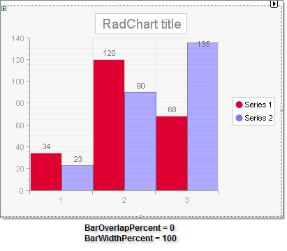
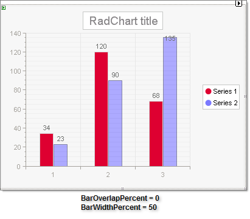
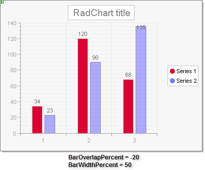
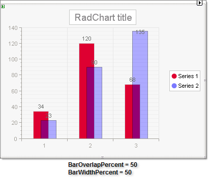

# BarOverlapPercent and BarWidthPercent

## 

In bar charts with multiple series __BarOverlapPercent__ governs to what degree the bars will overlap the preceding bar series. If you enter a negative value for __BarOverlapPercent__ , a gap appears between the bars of different series. Overlapping is especially useful when a long series of items needs to fit in a small-size chart. 

__BarWidthPercent__ controls how much space each bar takes up so that a __BarWidthPercent__ of 100 will have all the bars in the chart taking exactly all the available width. 

>note The maximum bar width is calculated as follows: *bar width* = *axis length* / *bars*  *count* .
>

See the examples below to see how these two properties work together.

