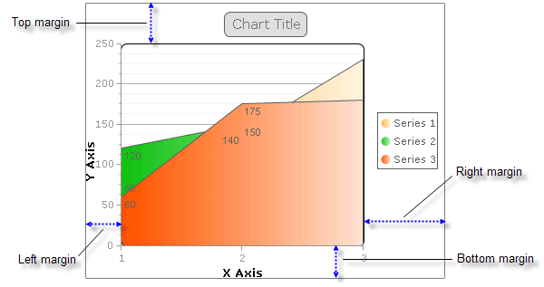
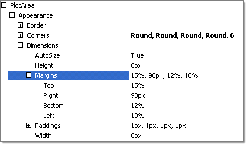

# Margins

## 

Chart margins are the distances from the outermost chart borders to the borders of the plot area.
>caption 

Margins are expressed in the RadChart PlotArea.Dimensions.Margins property and are specified in pixels or percentages. Percentages refer to a percentage of the RadChart width. In the figure below the dimensions are populated with some values in percentages, some in fixed pixels. 
>caption 

To provide extra space for positioning legends, labels and title, use greater margin values for the PlotArea to provide room.
