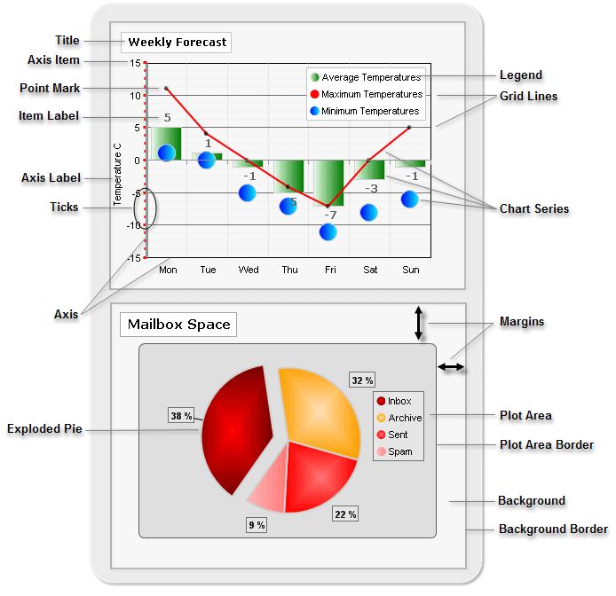

# Rad Chart Basics

Charts are composed of a hierarchy of elements. Most of the elements are common across all chart types (unless otherwise noted). The illustration below shows some of the significant chart elements.   
>caption 

## Chart Element Descriptions

|Element|Description|Element|Description|
|----|----|----|----|
| __Title__ |The heading for the chart as a whole. The position and appearance of the title is completely customizable.[Read More]()| __Legend__ |The legend contains a symbol and name for each series in the chart.  The legend may also display a series of items. The position and appearance of the legend can also be customized.[Read more]()|
| __Axis Item__ |Axis Items are the individual points along each axis that help indicate the axis measurement and scale.[Read more]()| __Grid Lines__ |Vertical and horizontal lines parallel to the X and Y axes.  These grid lines form the grid, making the chart easier to read.[Read more]()|
| __Point Mark__ |The point mark is a visual cue to enhance visibility of data points on line and area charts.[Read more]()   [Series Items]()| __Chart Series__ |Series contains a set of data points to be drawn on the chart. This set of points contains related data. Each series can be represented by a chart type. Pie charts use only a single series. For other chart types there is no limitation to the number of series or items within each series. Read more|
| __Item Label__ |The label next to each data point displaying a value or custom text.[Read more]()| __Margins__ |The distance between the outer edge of an item to the outer edge of the item containing it.  For example, the margin for the plot area is the distance from the plot area border to the outermost border of the chart. Plot area, legend and title all have margins.Read more|
| __Axis Label__ |The label next to each axis identifying the nature of data points found along that axis. Read more | __Plot Area__ |The area enclosed between the X and Y axes.[Read more]()|
| __Ticks__ |Axis ticks are small marks that identify the position of items on the axes and the starting points of gridlines.[Read more]()| __Plot Area Border__ |The line that encloses the area between the X and Y axes.[Read more]()|
| __Axis (X and Y)__ |These axes form the coordinates in which the data points are placed. Chart series items are displayed along the X and Y axes. __Note__ : Pie charts do not use axes.[Read more]()| __Background Border__ |The outermost line that encloses the whole chart area.[Read more]()|
| __Exploded Pie__ |A piece of the a Pie chart that is visually separated from the rest of the pie for easier distinction. Read more |||
