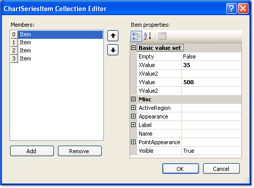

# Series Items

## 

Each chart series *item* encapsulates a single data point. 

The key properties are shown in the figure below in the property category "Basic value set". For simple charts along a single axis populate the __YValue__ property.  Use the __XValue__ property to add a second data dimension. For example, the Y values might be "Sales Volume" and the X values might be time periods or geographic regions.  __XValue2__ and __YValue2__ are used by [Gantt]() type to indicate a period of time and the [Bubble]() chart type to show amplitude of data. 

Set the Empty property to true to have RadChart approximate the value. The example below has a third item with the __Empty__ property set to True, causing the item to display by default as a unfilled dotted line with a label of 30.5 (the average of the  values that come before and after, 5 and 56, respectively). The look of the empty value is controlled by the EmptyValue property for the series __Appearance__.

Other significant properties for the __ChartSeriesItem__ are: 

* __ActiveRegion__: Contains HTML __Attributes__, __ToolTip__ and __URL__. These properties support making image maps.

* __Appearance__: This contains common visual properties __Border__, __Corners__, __FillStyle__ and __Visible__.  In addition the property __Exploded__ is specific to the [Pie]() chart property type.  When true, __Exploded__ displays a chart series item (a pie slice in this context) as slightly separated from the rest of the pie.

* __Label__: Use this property to override the default item label.  By default the numeric values of each data point are displayed on the chart.  Here you can use the Label.TextBlock.Text to add a more specific description of the data point. You have full control over each label HTML characteristics with the Label.ActiveRegion.  Control visual display and layout using the Label.Appearance property.
 
      
