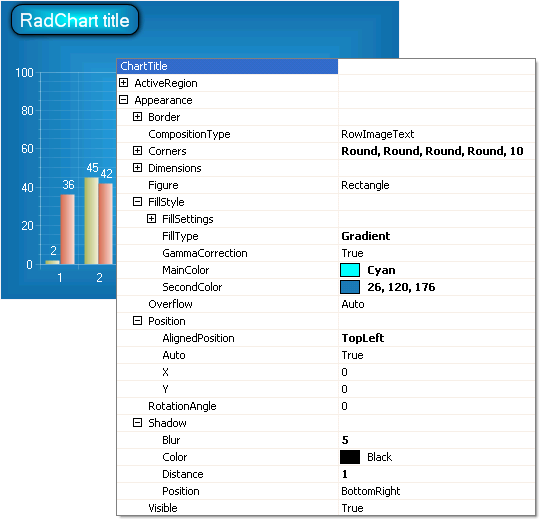

# Titles

## 

The title for the chart as a whole is controlled by the RadChart.ChartTitle object. The following sub properties of ChartTitle allow you to format the text, marker and overall appearance of the title: 

* __ActiveRegion__: ActiveRegion contains properties for HTML __Attributes__, __Tooltip__ and __URL.__  

* __Appearance__ controls visibility, __Border__, __Corners__, __Dimensions__, __FillStyle__, __Position__, __RotationAngle__ and __Shadow__ for the title. Use the Position.AlignedPosition to place the title area in a predefined position (e.g. __Left__, __Right__, __Center__, __Top__, __Bottom__, __BottomRight__, __BottomLeft__, __TopRight__, __TopLeft__), or set the __Auto__ property off and use the __X__ and __Y__ properties to place the chart title anywhere on the chart including the plot area. 

* __Marker__ controls a small graphic for the title area. By default the marker is not visible. 

* The __TextBlock__ properties provides fine tune control over the text and text background.

In the example below the title is customized so that the position is aligned to the top left, corners are rounded, the fill is a gradient fill radiating from the center and a shadow makes it stand out from the background.
