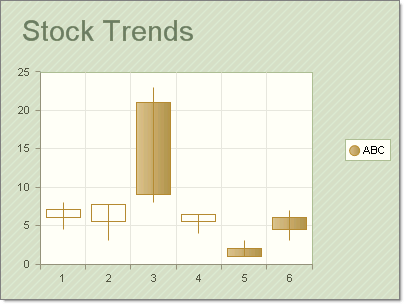
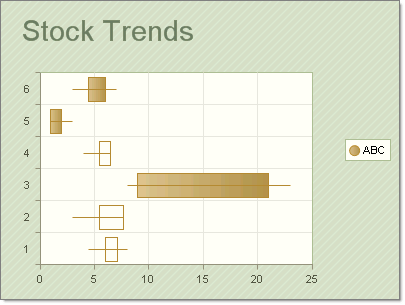

# CandleStick Charts

## 

The __CandleStick__ chart combines bar and line chart styles to show a range of value movement over time. A filled bar indicates the opening value was greater than the closing value.  An empty bar indicates that the closing value was greater than the opening value. The line through the center (the "wick") shows the extreme high and low values. The meaning of the Y values in a CandleStick chart are:  

* YValue = Open

* YValue2 = Close

* YValue 3 = Max

* YValue 4 = Min

The "bar" portion of each chart item is formed between the __YValue__ and __YValue2__ properties.  The "wick" portion of the chart is defined with the YValue3 and YValue4 chart item properties.

To create a Vertical CandleStick Chart set the __SeriesOrientation__ property to __Vertical__. Set the RadChart __DefaultType__ property or __ChartSeries.Type__ to __CandleStick__.
>caption 

To create a Vertical CandleStick Chart set the __SeriesOrientation__ property to __Horizontal__. Set the RadChart __DefaultType__ property or __ChartSeries.Type__ to __CandleStick__.
>caption 

The screenshots above use the following data points:

| __YValue__ | __YValue2__ | __YValue3__ | __YValue4__ |
|----|----|----|----|
|6|7.1|4.5|8|
|5.5|7.7|3|6|
|21|9|8|23|
|5.5|6.5|4|6.5|
|6|4.5|3|7|
|||||
