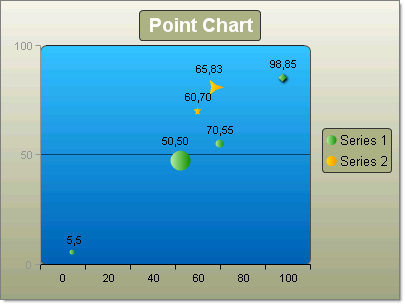
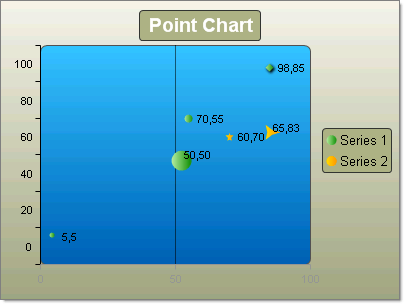

# Point Charts

## 

Point or "Scatter" charts are used to show correlations between two sets of values.  The point chart lets you observe the dependence of one value to another and is often used for scientific data modeling. The Point chart is typically not used used with time dependent data where a Line chart is more suited. 

To change the display of any given point use the chart item's __PointAppearance__ property. Here you can change the __Dimensions__ property to control __Height__, __Width__, __Margins__ and __Paddings__. The __Figure__ property lets you choose from a set of predefined shapes other than the default __Ellipse__ shape (e.g. __Cross__, __Diamond__, __Circle__, __Rectangle__, __Triangle__ and several different __Star__ marker shapes).

To create a Vertical Point Chart set the __SeriesOrientation__ property to __Vertical__. Set the RadChart __DefaultType__ property or __ChartSeries.Type__ to __Point__. Add one or more chart series to the __Series__ collection.  Add one or more chart items to the series __Items__ collection. Populate numeric values for __XValue__ and __YValue__ properties of each chart series item.
>caption 

To create a Vertical Point Chart set the __SeriesOrientation__ property to __Horizontal__. Set the RadChart __DefaultType__ property or __ChartSeries.Type__ to __Point__. Add one or more chart series to the __Series__ collection.  Add one or more chart items to the series __Items__ collection. Populate numeric values for __XValue__ and __YValue__ properties of each chart series item.
>caption 

