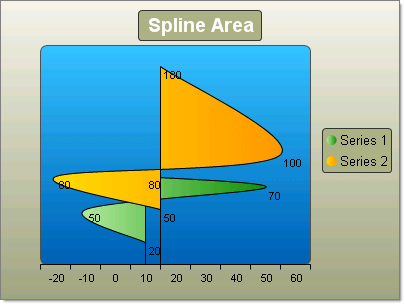
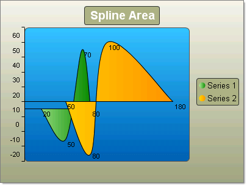

# Spline Area Charts

## 

Spline charts allow you to take a limited set of known data points and approximate intervening values. In the Spline Area Chart the area defined by the spline curve is filled. In practice you define a series of chart items and RadChart does the rest. Each series overlays the preceding, from back to front.

To create a simple vertical Spline Area Chart set the __SeriesOrientation__ property to __Vertical__. Set the RadChart __DefaultType__ property or __ChartSeries.Type__ to __SplineArea__. Create one or more series and add chart items with Y or X and Y values.
>caption 

To create a simple vertical Spline Area Chart set the __SeriesOrientation__ property to __Horizontal__. Set the RadChart __DefaultType__ property or __ChartSeries.Type__ to __SplineArea__. Create one or more series and add chart items with Y or X and Y values.
>caption 

