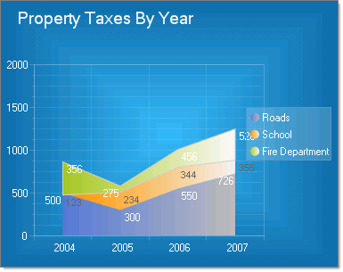
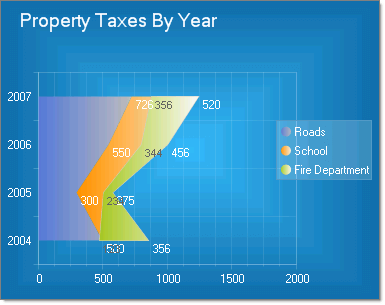

# Stacked Area Charts

## 

The Stacked Area chart is a variation of the Area chart that display trends of the contribution of each value over time (or across categories). The areas are stacked so that each series adjoins but does not overlap the preceding series.  This contrasts with the Area chart where each series overlays the preceding series. 

Depending on the __Skin__ used, RadChart can automatically differentiate each series by displaying it in a different color. The appearance for each series can also be modified directly.

To create a Vertical Stacked Area Chart set the __SeriesOrientation__ property to __Vertical__. Set the RadChart __DefaultType__ property or __ChartSeries.Type__ to __StackedArea__.
>caption 

To create a Vertical Stacked Area Chart set the __SeriesOrientation__ property to __Horizontal__. Set the RadChart __DefaultType__ property or __ChartSeries.Type__ to __StackedArea__.
>caption 

